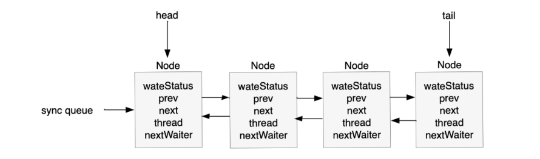

### 一、定义：

抽象队列监视器

CLH锁：基于链表的可扩展、高性能、公平的**自旋锁**，它不断轮询前驱的状态，如果发现前驱释放了锁就结束自旋

### 二、代码分析

解释：

等待队列是“CLH”锁队列的变体。CLH队列通常用来实现**自旋锁**。相反，我们使用它们来阻塞同步器，但是使用相同的基本策略，即在其节点的前身中保存关于线程的一些控制信息。每个节点中的**状态**字段跟踪线程是否应该阻塞。节点在其前任节点释放时发出信号。否则，队列的每个节点都充当一个特定的通知样式的监视器，其中包含一个等待线程。状态字段不控制线程是否被授予锁等。一个线程可能试图获取队列中的第一个线程。但领先并不能保证成功，它只会给你竞争的权利。因此，当前发布的竞争者线程可能需要重新等待。


插入CLH队列只需要对“tail”进行一个原子操作(入队)，因此从未排队到排队有一个简单的原子操作。类似地，离队只涉及到更新“头部”（出队）。但是，节点需要做更多的工作来确定它们的后继节点是谁，部分是为了处理由于超时和中断而可能出现的取消。

“prev”链接(在原始的CLH锁中不使用)，主要用于处理取消。如果一个节点被取消，它的后继节点(通常)被重新链接到一个未取消的前继节点。关于旋转锁类似力学的解释，请参阅Scott和Scherer在http://www.cs.rochester.edu/u/scott/synchronization上发表的论文

我们还使用“下一个”链接来执行阻塞机制。每个节点的线程id都保存在其自己的节点中，因此前任节点通过遍历下一个链接来确定它是哪个线程，从而向下一个节点发出唤醒信号。确定后继节点必须避免与新排队的节点竞争，以设置其前一节点的“next”字段。这个问题在必要时可以通过在节点的后继节点为空时从原子更新的“tail”向后检查来解决。(或者换句话说，下一个链接是一种优化，因此我们通常不需要向后扫描。)

消去为基本算法引入了一些保守性。因为我们必须轮询其他节点的取消，所以我们可能无法注意被取消的节点是在我们前面还是后面。解决这个问题的方法是在取消时总是解除继任者，允许他们稳定在新的前任上，除非我们可以确定一个未取消的前任谁将承担这个责任。

CLH队列需要一个虚拟头节点来启动。但我们并不通过构造函数来创建，因为如果没有争论，那么努力就白费了。相反，在第一次争用时构造节点并设置头指针和尾指针。

等待条件的线程使用相同的节点，但使用额外的链接。条件只需要链接简单(非并发)链接队列中的节点，因为它们只在独占时被访问。在等待时，节点被插入到条件队列中。信号时，节点为转移到主队列。status字段的一个特殊值用于标记节点所在的队列。

###### 成员变量

```java


```


###### 内部类(等待队列数据模型)

```java
static final class Node {
    	// 共享模式
        static final Node SHARED = new Node();
    	// 独占模式
        static final Node EXCLUSIVE = null;
    	// 表示线程已取消
        static final int CANCELLED =  1;
        // 表示后继线程需要解除驻留
        static final int SIGNAL    = -1;
        // 表示线程处于等待状态
        static final int CONDITION = -2;
       	// 表示下一个被请求的应该无条件地传播
        static final int PROPAGATE = -3;
    
        volatile int waitStatus;

        volatile Node prev;

        volatile Node next;

        volatile Thread thread;

        Node nextWaiter;

        final boolean isShared() {
            return nextWaiter == SHARED;
        }

        final Node predecessor() throws NullPointerException {
            Node p = prev;
            if (p == null)
                throw new NullPointerException();
            else
                return p;
        }

        Node() {    // Used to establish initial head or SHARED marker
        }

        Node(Thread thread, Node mode) {     // Used by addWaiter
            this.nextWaiter = mode;
            this.thread = thread;
        }

        Node(Thread thread, int waitStatus) { // Used by Condition
            this.waitStatus = waitStatus;
            this.thread = thread;
        }
    }
```

###### 成员变量

```java
 	// 阻塞等待队列的头
    private transient volatile Node head;

   	// 阻塞队列的尾部
    private transient volatile Node tail;
	
	// 状态
    private volatile int state;
```

###### 改变状态的方法

```java
// 改变state的值，使用（CAS）原子操作  
protected final boolean compareAndSetState(int expect, int update) {
 		// 如果内存中的值跟期望值相同，则更新成新的值
        return unsafe.compareAndSwapInt(this, stateOffset, expect, update);
    }
```

###### 入队列（放入到队列的最后一个）

```java
 private Node enq(final Node node) {
        for (;;) {
            Node t = tail;
            // 
            if (t == null) { // Must initialize
                if (compareAndSetHead(new Node()))
                    tail = head;
            } else {
                // 进入排队等待
                node.prev = t;
                if (compareAndSetTail(t, node)) {
                    t.next = node;
                    return t;
                }
            }
        }
    }
```

###### 将线程添加到等待队列里

```java
 private Node addWaiter(Node mode) {
     	// 创建一个线程节点，放到等待队列中
        Node node = new Node(Thread.currentThread(), mode);
        // Try the fast path of enq; backup to full enq on failure
        Node pred = tail;
        if (pred != null) {
            node.prev = pred;
            if (compareAndSetTail(pred, node)) {
                pred.next = node;
                return node;
            }
        }
        enq(node);
        return node;
    }
```

###### 唤起当前节点的后继节点

```java

private void unparkSuccessor(Node node) {
        int ws = node.waitStatus;
        if (ws < 0)
            compareAndSetWaitStatus(node, ws, 0);
        Node s = node.next;
        if (s == null || s.waitStatus > 0) {
            s = null;
            for (Node t = tail; t != null && t != node; t = t.prev)
                if (t.waitStatus <= 0)
                    s = t;
        }
        if (s != null)
            // 启动线程
            LockSupport.unpark(s.thread);
    }
```



自旋锁前驱队列：https://blog.csdn.net/qq_37425816/article/details/105349516

### AbstractOwnableSynchronizer

定义：抽象类，一个线程独占的同步器，该类提供了创建锁和相关同步器的基础，这些同步器可能需要所有权的概念，AbstractOwnableSynchronizer类本身不管理或使用此信息，但是，子类和工具可以使用适当维护的值来帮助控制和监视访问并提供诊断。


### AbstractQueuedSynchronizer

定义：也是一个抽象类，无法实例化对象，提供了一个**框架**来实现**阻塞锁**和**依赖于先进先出(FIFO)等待队列**的相关同步器(信号量、事件等)，这个类被设计为大多数依赖于单个原子整数值来表示状态的同步器的有用的基础类。子类必须定义改变这种状态的受保护方法，这些方法定义了这种状态在获取或释放对象时的含义。【该类只是提供了一套实现锁的框架】，需要子类自行实现改变状态的方法。

- getState()方法
- setState(int)方法
- compareAndSetState(int,int)方法

以上这段话总结：

- AQS是一个抽象的**同步器**框架
- 使用整数值来标识**同步器**的状态
- 需要子类自行实现改变**同步器**状态的方法

子类（AbstractQueuedSynchronizer的子类）应该定义为**非公共的内部助手类**，用于实现其外围类的同步属性。类AbstractQueuedSynchronizer不实现任何同步接口。相反，它定义了诸如acquireinterruptible (int)这样的方法，具体锁和相关同步器可以适当地调用这些方法来实现它们的公共方法。

以上这段话总结：

- AQS的的实现类应该定义为一个工具类的私有内部类,作为这个类的同步器，参照java.util.concurrent.locks.ReentrantLock.Sync的实现

该类支持默认**独占模式**和**共享模式**中的一种或两种，当以独占模式获取时，其他线程尝试获取无法成功，多个线程获取共享模式可能(但不一定)成功，在不同模式下等待的线程共享相同的FIFO队列，通常，实现子类只支持其中一种模式，但两者都可以发挥作用，例如在ReadWriteLock【读写锁】中。

以上这段话总结：

- AQS同步器可支持独占模式和共享模式

这个类定义了一个嵌套的AbstractQueuedSynchronizer.ConditionObject,可以被支持【独占模式】的子类用作条件实现的条件对象类，isheldexcluvely()方法报告同步是否被相对于当前线程独占。

要将此类用作同步器的基础，请酌情重新定义以下方法。通过getState()方法获取状态，通过同步的方式修改状态，使用setState(int)或者compareAndSetState(int, int)方法：

- tryAcquire(int)
- tryRelease(int)
- tryAcquireShared(int)
- tryReleaseShared(int)
- isHeldExclusively()

默认情况下，这些方法都会抛出UnsupportedOperationException,这些方法的实现必须是内部线程安全的。

即使这个类基于内部FIFO队列，它也不会自动执行FIFO获取策略。独占同步的核心形式为:

```
Acquire:
     while (!tryAcquire(arg)) {
        enqueue thread if it is not already queued;
        possibly block current thread;
     }

 Release:
     if (tryRelease(arg))
        unblock the first queued thread;
```

### AbstractQueuedSynchronizer.Node

