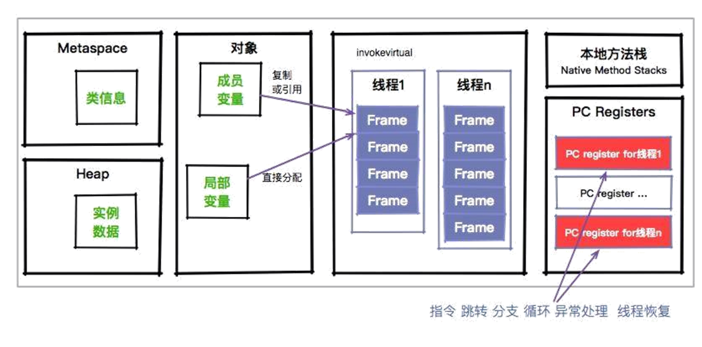

# JVM学习

## class文件结构

参考java官方文档：https://docs.oracle.com/javase/specs/jvms/se8/html/jvms-4.html

定义：java源代码文件经过编译后紧凑的有一定规律的字节码文件。

```
ClassFile {
    u4             magic;--魔数（4个字节）固定值：CAFEBABE
    u2             minor_version;--次版本号（2个字节）
    u2             major_version;--主版本号（2个字节）class文件的版本号：【主版本号.次版本号】，如【52.0】
    u2             constant_pool_count;--常量池的长度
    cp_info        constant_pool[constant_pool_count-1];--常量池表
    u2             access_flags;--访问标识（public、final、interface、枚举、注解 等等）
    u2             this_class;--类索引，指向常量池的有效索引
    u2             super_class;--父类索引 指向常量池的有效索引
    u2             interfaces_count;
    u2             interfaces[interfaces_count];
    u2             fields_count;
    field_info     fields[fields_count];
    u2             methods_count;
    method_info    methods[methods_count];
    u2             attributes_count;
    attribute_info attributes[attributes_count];
}
```

**注：u代表无符号的整型，u4代表4个字节（32位）无符号的整型，以此类推**

可以结合使用idea中的JclassLib插件学习class文件，更容易理解。

**jdk中JVM版本与可以执行的class文件版本之间的关系**

class版本号从45开始

| JDK       | Class_Version |
| --------- | ------------- |
| 1.0.2     | 45.0~45.3     |
| 1.1.*     | 45.0~45.65535 |
| 1.k(k>=2) | 45.0~44+k.0   |


### 常量池cp_info结构

cp_info是一个数组形式的数据结构，其中每一项的格式如下：

```
cp_info {
    u1 tag;--代表类型，下面info的值随着tag的变化而变化，如下tags表所示
    u1 info[];
}
```

| CONSTANT_Class              | 7    | 类或接口的符号引用                                           |
| --------------------------- | ---- | ------------------------------------------------------------ |
| CONSTANT_Fieldref           | 9    | 代表字段的**符号引用**                                       |
| CONSTANT_Methodref          | 10   | 代表方法的**符号引用**                                       |
| CONSTANT_InterfaceMethodref | 11   | 代表接口中方法的**符号引用**                                 |
| CONSTANT_String             | 8    | 代表字符串类型的**字面量**                                   |
| CONSTANT_Integer            | 3    | 代表整型**字面量**                                           |
| CONSTANT_Float              | 4    | 代表浮点型**字面量**                                         |
| CONSTANT_Long               | 5    | 代表长整型**字面量**                                         |
| CONSTANT_Double             | 6    | 代表双精度浮点型**字面量**                                   |
| CONSTANT_NameAndType        | 12   | 字段或方法的部分**符号引用**【表示字段或方法的名称和类型】，比如类中的字段 private String name  字段名称为“name” 类型为String |
| CONSTANT_Utf8               | 1    | **代表utf-8编码的字符串**                                    |
| CONSTANT_MethodHandle       | 15   | 方法**句柄**，我理解这个代表了某个方法的执行类型（字节码行为），是取值，调用，还是.... |
| CONSTANT_MethodType         | 16   | 方法**类型**                                                 |
| CONSTANT_InvokeDynamic      | 18   | 动态方法调用点                                               |

#### CONSTANT_Class_info 

类描述常量信息结构

```
CONSTANT_Class_info {
    u1 tag;--标志位，值为7
    u2 name_index;--指向常量池中一个CONSTANT_Utf8的类型常量的位置
}
```

#### CONSTANT_Fieldref_info

代表字段的符号引用，CONSTANT_Methodref_info、CONSTANT_InterfaceMethodref_info类似，如下：

```
// 字段符号引用
CONSTANT_Fieldref_info {
    u1 tag;--值为9
    u2 class_index;--指向常量池中一个CONSTANT_Class类型的位置值
    u2 name_and_type_index;
}
// 方法符号引用
CONSTANT_Methodref_info {
    u1 tag;--值为10
    u2 class_index;--指向常量池中一个CONSTANT_Class类型的位置值
    u2 name_and_type_index;
}
// 接口方法符号引用
CONSTANT_InterfaceMethodref_info {
    u1 tag;--值为11
    u2 class_index;指向常量池中一个CONSTANT_Class【接口】类型的位置值
    u2 name_and_type_index;
}
```

#### CONSTANT_String_info

代表字符串类型的**字面量**，结构如下：

```
CONSTANT_String_info {
    u1 tag;--值为8
    u2 string_index;指向常量池中一个CONSTANT_Utf8【uft-8编码】类型的位置值（表示要初始化String对象的Unicode码位）
}
```

#### CONSTANT_Integer_info 

代表整型**字面量**， CONSTANT_Float_info与之类似，结构如下：

```
// 整型
CONSTANT_Integer_info {
    u1 tag;--值为3
    u4 bytes;
}

// 浮点型
CONSTANT_Float_info {
    u1 tag;--值为4
    u4 bytes;
}
```

#### CONSTANT_Long_info 

代表长整型字面量， CONSTANT_Double_info 与之类似，结构如下：

```
// 长整型
CONSTANT_Long_info {
    u1 tag;--值5
    u4 high_bytes;
    u4 low_bytes;
}

// 双精度浮点型
CONSTANT_Double_info {
    u1 tag;--值6
    u4 high_bytes;
    u4 low_bytes;
}
```

#### CONSTANT_NameAndType_info 

CONSTANT_NameAndType_info结构用于表示一个字段或方法，而不指明它属于哪个类或接口类型:

```
CONSTANT_NameAndType_info {
    u1 tag;--值为12
    u2 name_index;--指向常量池中一个CONSTANT_Utf8_info结构
    u2 descriptor_index;--字段或者方法的描述，指向常量池中一个CONSTANT_Utf8_info结构
}
```

#### CONSTANT_Utf8_info 

CONSTANT_Utf8_info结构用于表示Unicode码:

```
CONSTANT_Utf8_info {
    u1 tag;--值为1
    u2 length;--bytes数组中的字节数(而不是结果字符串的长度)。
    u1 bytes[length];--包含的字节数组
}
```

#### CONSTANT_MethodHandle_info 

CONSTANT_MethodHandle_info结构用于表示一个方法句柄:

```
CONSTANT_MethodHandle_info {
    u1 tag;--值为15
    u1 reference_kind;--值必须在1到9之间。该值表示该方法句柄的类型，它描述了字节码行为
    u2 reference_index;
}
```

### JVM内存分布

#### 运行时内存区域划分


由上图可知：本地内存=元空间+直接内从，元空间中包含方法区。

#### 线程栈


#### 栈帧


这里有一个两层的栈。第一层是栈帧，对应着方法；第二层是方法的执行，对应着操作数。

所有的字节码指令，其实都会抽象成对栈的入栈出栈操作。执行引擎只需要傻瓜式的按顺序执行，就可以保证它的正确性。

#### 程序计数器



程序计数器是一块较小的内存空间，它的作用可以看作是当前线程所执行的字节码的行号指示器。这里面存的，就是当前线程执行的进度。

程序计数器也是因为线程而产生的，与虚拟机栈配合完成计算操作。程序计数器还存储了当前正在运行的流程，包括正在执行的指令、跳转、分支、循环、异常处理等。

既然是线程，就代表它在获取 CPU 时间片上，是不可预知的，需要有一个地方，对线程正在运行的点位进行缓冲记录，以便在获取 CPU 时间片时能够快速恢复。

下面这张图，就是使用 javap 命令输出的字节码。大家可以看到在每个 opcode 前面，都有一个序号。就是图中红框中的偏移地址，你可以认为它们是程序计数器的内容。


#### 堆（heap）


堆是 JVM 上最大的内存区域，我们申请的几乎所有的对象，都是在这里存储的。我们常说的垃圾回收，操作的对象就是堆。

堆空间一般是程序启动时，就申请了，但是并不一定会全部使用(一般是初始配置的大小？)。

对象到底是在堆上创建还是在栈上创建?

基本类型和普通对象：方法体中的基本类型（包含引用类型）直接在栈上分配，其他的都在堆上分配（包括基本类型的数组形式，如int[]）

#### 元空间(Metaspace )


由上图可知：java8之前，永久代属于堆的一部分，java8之后，永久代由元空间代替，在非堆中（本地内存的一部分）