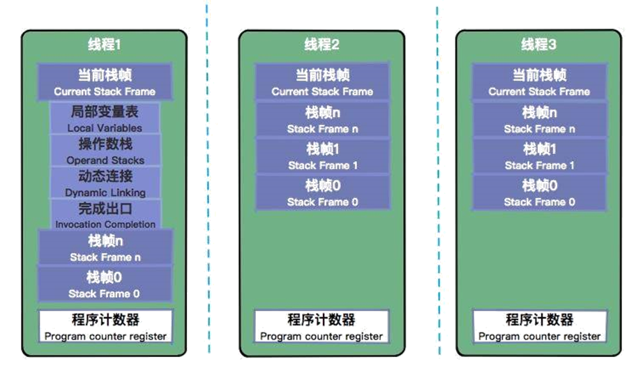
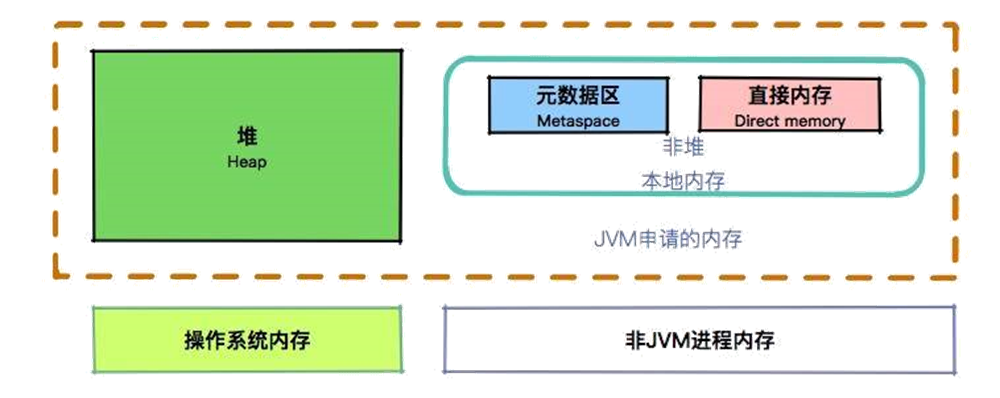
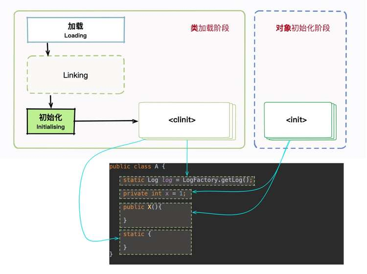

# JVM学习

## class文件结构

参考java官方文档：https://docs.oracle.com/javase/specs/jvms/se8/html/jvms-4.html

定义：java源代码文件经过编译后紧凑的有一定规律的字节码文件。

```
ClassFile {
    u4             magic;--魔数（4个字节）固定值：CAFEBABE
    u2             minor_version;--次版本号（2个字节）
    u2             major_version;--主版本号（2个字节）class文件的版本号：【主版本号.次版本号】，如【52.0】
    u2             constant_pool_count;--常量池的长度
    cp_info        constant_pool[constant_pool_count-1];--常量池表
    u2             access_flags;--访问标识（public、final、interface、枚举、注解 等等）
    u2             this_class;--类索引，指向常量池的有效索引
    u2             super_class;--父类索引 指向常量池的有效索引
    u2             interfaces_count;
    u2             interfaces[interfaces_count];
    u2             fields_count;
    field_info     fields[fields_count];
    u2             methods_count;
    method_info    methods[methods_count];
    u2             attributes_count;
    attribute_info attributes[attributes_count];
}
```

**注：u代表无符号的整型，u4代表4个字节（32位）无符号的整型，以此类推**

可以结合使用idea中的JclassLib插件学习class文件，更容易理解。

**jdk中JVM版本与可以执行的class文件版本之间的关系**

class版本号从45开始

| JDK       | Class_Version |
| --------- | ------------- |
| 1.0.2     | 45.0~45.3     |
| 1.1.*     | 45.0~45.65535 |
| 1.k(k>=2) | 45.0~44+k.0   |


### 常量池cp_info结构

cp_info是一个数组形式的数据结构，其中每一项的格式如下：

```
cp_info {
    u1 tag;--代表类型，下面info的值随着tag的变化而变化，如下tags表所示
    u1 info[];
}
```

| CONSTANT_Class              | 7    | 类或接口的符号引用                                           |
| --------------------------- | ---- | ------------------------------------------------------------ |
| CONSTANT_Fieldref           | 9    | 代表字段的**符号引用**                                       |
| CONSTANT_Methodref          | 10   | 代表方法的**符号引用**                                       |
| CONSTANT_InterfaceMethodref | 11   | 代表接口中方法的**符号引用**                                 |
| CONSTANT_String             | 8    | 代表字符串类型的**字面量**                                   |
| CONSTANT_Integer            | 3    | 代表整型**字面量**                                           |
| CONSTANT_Float              | 4    | 代表浮点型**字面量**                                         |
| CONSTANT_Long               | 5    | 代表长整型**字面量**                                         |
| CONSTANT_Double             | 6    | 代表双精度浮点型**字面量**                                   |
| CONSTANT_NameAndType        | 12   | 字段或方法的部分**符号引用**【表示字段或方法的名称和类型】，比如类中的字段 private String name  字段名称为“name” 类型为String |
| CONSTANT_Utf8               | 1    | **代表utf-8编码的字符串**                                    |
| CONSTANT_MethodHandle       | 15   | 方法**句柄**，我理解这个代表了某个方法的执行类型（字节码行为），是取值，调用，还是.... |
| CONSTANT_MethodType         | 16   | 方法**类型**                                                 |
| CONSTANT_InvokeDynamic      | 18   | 动态方法调用点                                               |

#### CONSTANT_Class_info 

类描述常量信息结构

```
CONSTANT_Class_info {
    u1 tag;--标志位，值为7
    u2 name_index;--指向常量池中一个CONSTANT_Utf8的类型常量的位置
}
```

#### CONSTANT_Fieldref_info

代表字段的符号引用，CONSTANT_Methodref_info、CONSTANT_InterfaceMethodref_info类似，如下：

```
// 字段符号引用
CONSTANT_Fieldref_info {
    u1 tag;--值为9
    u2 class_index;--指向常量池中一个CONSTANT_Class类型的位置值
    u2 name_and_type_index;
}
// 方法符号引用
CONSTANT_Methodref_info {
    u1 tag;--值为10
    u2 class_index;--指向常量池中一个CONSTANT_Class类型的位置值
    u2 name_and_type_index;
}
// 接口方法符号引用
CONSTANT_InterfaceMethodref_info {
    u1 tag;--值为11
    u2 class_index;指向常量池中一个CONSTANT_Class【接口】类型的位置值
    u2 name_and_type_index;
}
```

#### CONSTANT_String_info

代表字符串类型的**字面量**，结构如下：

```
CONSTANT_String_info {
    u1 tag;--值为8
    u2 string_index;指向常量池中一个CONSTANT_Utf8【uft-8编码】类型的位置值（表示要初始化String对象的Unicode码位）
}
```

#### CONSTANT_Integer_info 

代表整型**字面量**， CONSTANT_Float_info与之类似，结构如下：

```
// 整型
CONSTANT_Integer_info {
    u1 tag;--值为3
    u4 bytes;
}

// 浮点型
CONSTANT_Float_info {
    u1 tag;--值为4
    u4 bytes;
}
```

#### CONSTANT_Long_info 

代表长整型字面量， CONSTANT_Double_info 与之类似，结构如下：

```
// 长整型
CONSTANT_Long_info {
    u1 tag;--值5
    u4 high_bytes;
    u4 low_bytes;
}

// 双精度浮点型
CONSTANT_Double_info {
    u1 tag;--值6
    u4 high_bytes;
    u4 low_bytes;
}
```

#### CONSTANT_NameAndType_info 

CONSTANT_NameAndType_info结构用于表示一个字段或方法，而不指明它属于哪个类或接口类型:

```
CONSTANT_NameAndType_info {
    u1 tag;--值为12
    u2 name_index;--指向常量池中一个CONSTANT_Utf8_info结构
    u2 descriptor_index;--字段或者方法的描述，指向常量池中一个CONSTANT_Utf8_info结构
}
```

#### CONSTANT_Utf8_info 

CONSTANT_Utf8_info结构用于表示Unicode码:

```
CONSTANT_Utf8_info {
    u1 tag;--值为1
    u2 length;--bytes数组中的字节数(而不是结果字符串的长度)。
    u1 bytes[length];--包含的字节数组
}
```

#### CONSTANT_MethodHandle_info 

CONSTANT_MethodHandle_info结构用于表示一个方法句柄:

```
CONSTANT_MethodHandle_info {
    u1 tag;--值为15
    u1 reference_kind;--值必须在1到9之间。该值表示该方法句柄的类型，它描述了字节码行为
    u2 reference_index;
}
```

### JVM内存分布

#### 运行时内存区域划分


由上图可知：本地内存=元空间+直接内从，元空间中包含方法区。

#### 线程栈



#### 栈帧


这里有一个两层的栈。第一层是栈帧，对应着方法；（第二层是方法的执行，对应着操作数，即字节码指令）。

所有的字节码指令，其实都会抽象成对栈的入栈出栈操作。执行引擎只需要傻瓜式的按顺序执行，就可以保证它的正确性。

#### 程序计数器


程序计数器是一块较小的内存空间，它的作用可以看作是当前线程所执行的字节码的行号指示器。这里面存的，就是当前线程执行的进度。

程序计数器也是因为线程而产生的，与虚拟机栈配合完成计算操作。程序计数器还存储了当前正在运行的流程，包括正在执行的指令、跳转、分支、循环、异常处理等。

既然是线程，就代表它在获取 CPU 时间片上，是不可预知的，需要有一个地方，对线程正在运行的点位进行缓冲记录，以便在获取 CPU 时间片时能够快速恢复。

下面这张图，就是使用 javap 命令输出的字节码。大家可以看到在每个 opcode 前面，都有一个序号。就是图中红框中的偏移地址，你可以认为它们是程序计数器的内容。


#### 堆（heap）


堆是 JVM 上最大的内存区域，我们申请的几乎所有的对象，都是在这里存储的。我们常说的垃圾回收，操作的对象就是堆。

堆空间一般是程序启动时，就申请了，但是并不一定会全部使用(一般是初始配置的大小？)。

对象到底是在堆上创建还是在栈上创建?

基本类型和普通对象：方法体中的基本类型（包含引用类型）直接在栈上分配，其他的都在堆上分配（包括基本类型的数组形式，如int[]）

#### 元空间(Metaspace )


由上图可知：java8之前，永久代属于堆的一部分，java8之后，永久代由元空间代替，在非堆中（本地内存的一部分）

#### 堆、非堆、本地内存的关系

如下图：



(1)堆和非堆都属于JVM虚拟机运行时申请的运行时内存。

(2)非堆属于本地内从，里面宝行元数据区和直接内从。

### 类加载过程


##### 加载

加载的主要作用是将外部的 .class 文件，加载到 Java 的方法区内，你可以回顾一下我们在上一课时讲的内存区域图。加载阶段主要是找到并加载类的二进制数据，比如从 jar 包里或者 war 包里找到它们（***主要是先把.class文件加载到内从也就是方法区内***）。

（1）通过一个全限定名（如com.XXX.XXX.XXX）来获取定义此类的二进制字节流。

（2）将二进制的静态结果转换成方法区的运行时数据结构

（3）***在内存中生成一个代表这个类的java.lang.Class对象，做为方法区这个类的各种数据的访问入口***

##### 验证

肯定不能任何 .class 文件都能加载，那样太不安全了，容易受到恶意代码的攻击。验证阶段在虚拟机整个类加载过程中占了很大一部分，不符合规范的将抛出 **java.lang.VerifyError 错误**。像一些低版本的 JVM，是无法加载一些高版本的类库的，就是在这个阶段完成的（***.class文件格式的验证，如文件魔数、主次版本号、常量池等等验证***）。

（1）文件格式的验证

（2）元数据的验证，字节码语义分析

（3）字节码验证，方法体执行逻辑的验证，通过数据流分析和控制流分析，确定程序语义是否合法符合逻辑。

##### 准备

从这部分开始，将为一些***类变量【static】***分配内存，并将其初始化为默认值。此时，实例对象还没有分配内存，所以这些动作是在***方法区***上进行的。

##### 解析

解析在类加载中是非常非常重要的一环，是***将符号引用替换为直接引用的***过程。

符号引用是一种定义，可以是任何字面上的含义，而直接引用就是直接指向目标的指针、相对偏移量。

直接引用的对象都存在于内存中，你可以把通讯录里的女友手机号码，类比为符号引用，把面对面和你吃饭的人，类比为直接引用（***把字节码文件中的符号引用转换成真正的内存布局之间的引用***）。

类或接口的解析、类方法解析、接口方法解析、字段解析，***解析过程保证了相互引用的完整性，把继承与组合推进到运行时***

在解析阶段经常发生的异常：

***java.lang.NoSuchFieldError、java.lang.IllegalAccessError、java.lang.NoSuchMethodError***

##### 初始化

初始化成员变量了，到了这一步，才真正开始执行一些字节码。

规则：

JVM 会保证在子类的初始化方法执行之前，父类的初始化方法已经执行完毕。



### 类加载器-ClassLoader

***处于安全性而出现的类加载机制。***

如果你在项目代码里，写一个 java.lang 的包，然后改写 String 类的一些行为，编译后，发现并不能生效。JRE 的类当然不能轻易被覆盖，否则会被别有用心的人利用，这就太危险了。

#### JVM几种类加载器

(1)***Bootstrap ClassLoader：启动类加载器***，等级最高的，所有的类加载必须先经过此加载器，主要加载核心类库，如rt.jar,使用C++编写，随JVM启动而启动。

(2***)Extention ClassLoader:扩展类加载器***，主要用于加载 lib/ext 目录下的 jar 包和 .class 文件。同样的，通过系统变量 java.ext.dirs 可以指定这个目录。

(3)***App ClassLoader:应用类加载器***，这是我们写的 Java 类的默认加载器，有时候也叫作 System ClassLoader。一般用来加载 classpath 下的其他所有 jar 包和 .class 文件，我们写的代码，会首先尝试使用这个类加载器进行加载。

(4)***Custom ClassLoader:自定义类加载器***，支持一些个性化的扩展功能。

#### 双亲委派机制

双亲委派机制：除了顶层的***启动类加载器***以外，其余的类加载器，在加载之前，都会委派给它的父加载器进行加载。这样一层层向上传递，直到祖先们都无法胜任，它才会真正的加载。


#### 破坏双亲委派机制

本质上是使用***自定义类加载器***来实现的。

##### tomcat类加载机制


对于一些需要加载的非基础类，会由一个叫作 WebAppClassLoader 的类加载器优先加载。等它加载不到的时候，再交给上层的 ClassLoader 进行加载。这个加载器用来隔绝不同应用的 .class 文件，比如你的两个应用，可能会依赖同一个第三方的不同版本，它们是相互没有影响的。

如何在同一个 JVM 里，运行着不兼容的两个版本，当然是需要自定义加载器才能完成的事。

那么 tomcat 是怎么打破双亲委派机制的呢？可以看图中的 WebAppClassLoader，它加载自己目录(WEB-INF/classes和WEB-INF/lib)下的 .class 文件，并不会传递给父类的加载器。但是，它却可以使用 SharedClassLoader 所加载的类，实现了共享和分离的功能。

但是你自己写一个 ArrayList，放在应用目录里，tomcat 依然不会加载。它只是自定义的加载器顺序不同，但对于顶层来说，还是一样的。

##### SPI机制 和OSGI

### 字节码指令

java编译命令：

```
javac -g:lines -g:vars User.java -encoding utf-8 （强制生成 LineNumberTable 和 LocalVariableTable）
```


java运行命令：


含有包的java类在运行时，需要在包结构外面运行，而且需要使用全限定的类名（实际上类文件所在的目录结构就是包结构）

java字节文件查看指令：

```
javap -p -v UserBiz
```

class文件反编译内容：

```java
Classfile /D:/ideaPoject/javaBase/src/main/java/com/xyz/java/base/pojo/UserBiz.class
  Last modified 2022-3-12; size 497 bytes
  MD5 checksum 4be80f57f07fe4ca07000fc2046e24b6
public class com.xyz.java.base.pojo.UserBiz
  minor version: 0
  major version: 52
  flags: ACC_PUBLIC, ACC_SUPER
Constant pool:
   #1 = Methodref          #6.#20         // java/lang/Object."<init>":()V
   #2 = Class              #21            // com/xyz/java/base/pojo/User
   #3 = Methodref          #2.#20         // com/xyz/java/base/pojo/User."<init>":()V
   #4 = Methodref          #2.#22         // com/xyz/java/base/pojo/User.eat:()V
   #5 = Class              #23            // com/xyz/java/base/pojo/UserBiz
   #6 = Class              #24            // java/lang/Object
   #7 = Utf8               <init>
   #8 = Utf8               ()V
   #9 = Utf8               Code
  #10 = Utf8               LineNumberTable
  #11 = Utf8               LocalVariableTable
  #12 = Utf8               this
  #13 = Utf8               Lcom/xyz/java/base/pojo/UserBiz;
  #14 = Utf8               main
  #15 = Utf8               ([Ljava/lang/String;)V
  #16 = Utf8               args
  #17 = Utf8               [Ljava/lang/String;
  #18 = Utf8               user
  #19 = Utf8               Lcom/xyz/java/base/pojo/User;
  #20 = NameAndType        #7:#8          // "<init>":()V
  #21 = Utf8               com/xyz/java/base/pojo/User
  #22 = NameAndType        #25:#8         // eat:()V
  #23 = Utf8               com/xyz/java/base/pojo/UserBiz
  #24 = Utf8               java/lang/Object
  #25 = Utf8               eat
{
  public com.xyz.java.base.pojo.UserBiz();
    descriptor: ()V
    flags: ACC_PUBLIC
    Code:
      stack=1, locals=1, args_size=1
         0: aload_0
         1: invokespecial #1                  // Method java/lang/Object."<init>":()V
         4: return
      LineNumberTable:
        line 8: 0
      LocalVariableTable:
        Start  Length  Slot  Name   Signature
            0       5     0  this   Lcom/xyz/java/base/pojo/UserBiz;

  public static void main(java.lang.String[]);
    descriptor: ([Ljava/lang/String;)V
    flags: ACC_PUBLIC, ACC_STATIC
    Code:
      stack=2, locals=2, args_size=1
         0: new           #2                  // class com/xyz/java/base/pojo/User
         3: dup
         4: invokespecial #3                  // Method com/xyz/java/base/pojo/User."<init>":()V
         7: astore_1
         8: aload_1
         9: invokevirtual #4                  // Method com/xyz/java/base/pojo/User.eat:()V
        12: return
      LineNumberTable:
        line 10: 0
        line 11: 8
        line 12: 12
      LocalVariableTable:
        Start  Length  Slot  Name   Signature
            0      13     0  args   [Ljava/lang/String;
            8       5     1  user   Lcom/xyz/java/base/pojo/User;
}

```

java字节码执行指令：

```
invokespecial #1   --执行init（构造方法）
```

```
invokevirtual #4   --执行一般对象的方法
```

字节码执行过程

