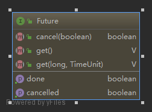

### java-8语言特性

（1）**Lambda 表达式** − Lambda 允许把函数作为一个方法的参数（函数作为参数传递到方法中）

（2）**方法引用** − 方法引用提供了非常有用的语法，可以直接引用已有Java类或对象（实例）的方法或构造器。与lambda联合使用，方法引用可以使语言的构造更紧凑简洁，减少冗余代码。可以理解为：更简洁的方法调用。

（3）**默认方法** − 默认方法就是一个在接口里面有了一个实现的方法。

（4）**重复注解** − 重复注释提供了将同一注释类型多次应用于同一声明或类型使用的能力。比如  @service 可以多次应用在类上。

（5）**StreamAPI** − 对集合的流式操作，对元素进行批量操作。

有几个重要的概念：过滤器，映射器，迭代器，这些操作操作称为聚合操作函数

Predicate：谓语函数接口，用于判断条件，返回一个boolean值

Consumer：接口单个参数，没有返回值得函数接口


### java-Object类

**定义：**所有的java对象的根类，所有的对象，数组都实现了Object类的方法。

**方法解读**

（1）getClass：返回java运行时的Class对象

（2）hashCode：返回对象的哈希码值。支持这种方法是因为HashMap提供的哈希表的好处。

​     一个对象在程序运行的过程中，多次调用hashCode方法返回的值总是相同的int值。

​     如果两个对象使用equals方法对比相等，那这个两个对象必然是hashCode也相等。

 （3）equals：比较两个对象的应用是否相等（**equals方法在非空对象引用上实现了一个等价关系**）

 （4）clone：复制并返回对象

 （5）notify：唤醒在此对象的【监视器】上【等待】的【单个线程】，如果有多个线程正在等待这个对象，那么其中一个线程将被唤醒（如果有多个线程争抢该对象上的锁，notify通知之后，只有其中的一个线程能获取对象的锁）线程通过调用一个等待（wait）方法来等待对象的监视器，被唤醒的线程仍然无法获取到锁，直到拥有对象锁的线程放弃了对象锁（本质上就是发出个通知：你们准备开始抢锁吧，等我执行完就开始抢 ）。

​         notify方法只能由对象监视器的所有者线程调用，线程可以通过3种方式拥有对象的监视器：

​         **通过执行该对象的同步实例方法**

​         **通过执行同步语句的主体对对象进行同步。**

​         **对于Class类型的对象，通过执行该类的同步静态方法。**

​       可能会导致死锁？

 （6）notifyAll：**唤醒在该对象的监视器上等待的所有线程**，最终所有等待的线程都会被执行，只是不是同时执行，都是按获取锁的执行顺序执行。

   **区别：**notify只是随机唤醒其中的一个等待线程，唤醒后不存在竞争锁的情况，而notifyAll 唤醒了所有wait的线程，存在锁竞争的情况。

  （7）wait：调用方法会使得当前线程等待，直到另一个线程调用该对象的notify()方法或notifyAll()方法

​            调用该方法的当前线程必须首先获得对象的监视器。

​     等待总是应该在循环中发生，虚假唤醒操作，如果使用if做判断，线程被唤醒后，会直接做下面的语句，形成一种虚假唤醒。

参考：https://baijiahao.baidu.com/s?id=1683304206957172623&wfr=spider&for=pc

​           https://www.cnblogs.com/amberbar/p/13290672.html


​     

```
 synchronized (obj) {
         while (<condition does not hold>)
             obj.wait(timeout);
         ... // Perform action appropriate to condition
     }
```

（5）finalize方法：当垃圾收集确定不再有对对象的引用时，**由垃圾收集器在对象上调用**。子类可以重写finalize方法以便在垃圾收集器调用的时候进行其他资源的释放，可以参照FileInputStream的finalize方法。

  **总结:**对象监视器，等待-通知-获取对象监视器-执行  模式来实现线程间通信

  每个锁对象都有两个队列，一个是就绪队列，一个是阻塞队列。就绪队列存储将要获取锁的线程，阻塞队列存储被阻塞的队列（例如线程被wait后就进入阻塞队列）。先进入阻塞队列，被唤醒后再进入就绪队列。

### java-Thread类

（1）sleep方法，线程停止执行，如果该线程拥有监视器，并不放弃监视器，依然拥有监视器。

（2）interrupt方法 中断线程方法，该方法执行后，线程不一定马上停止，只是加了一个停止的标记位。

（3）interrupted 方法：类的静态方法，测试**当前线程**是否已经被中断，调用该方法**将清除线程的中断状态**。

（4）isInterrupted方法：测试**此线程**是否已被中断。线程的中断状态不受此方法的影响。由于线程在中断时不是活动的而忽略的线程中断将由这个返回false的方法反映出来。

（5）join方法：等待线程执行结束（最多等待的时间可以设置），实现原理：外部线程调用执行线程的join（synchroized修饰），如果线程没有执行完成，则调用wait使得线程等待（释放锁），直到该线程运行结束,线程运行结束的时候会调用this.notifyAll(),则可继续运行代码，源码如下：

所以java的作者不建议在Thread类的实例中手动的调用wait，notify，notifyAll等方法

```java
public final synchronized void join(long millis) -- 使用了 synchronized 关键字修饰
    throws InterruptedException {
        long base = System.currentTimeMillis();
        long now = 0;

        if (millis < 0) {
            throw new IllegalArgumentException("timeout value is negative");
        }

        if (millis == 0) {// 没有设置等待时间时，一直默认等待，知道线程完成后
            while (isAlive()) {// 使用while的目的是为了防止“虚假唤醒”
                wait(0);// 调用该方法，会使得主线程停止，并且让出监视器，该线程执行结束的时候，会调用this.notifyAll，可使得任务继续运行。
            }
        } else {
            while (isAlive()) {// 如果线程还处于活动（未完成）状态
                long delay = millis - now;
                if (delay <= 0) {// 如果计算出的时间小于0，直接跳出循环
                    break;
                }
                wait(delay);//等待时间
                now = System.currentTimeMillis() - base; // 收到通知后已经运行的时间
            }
        }
    }
```

（6）yield方法：向调度器暗示当前线程愿意放弃当前对处理器的使用。线程调度器可以忽略这个提示。

（7）start方法：启动线程，线程不一定马上运行。如果线程不是初始状态“NEW”，则无法启动线程。

（8）isAlive方法：测试线程是否处于“活动”状态（何为活动状态？如果一个线程已经启动并且还没有死亡，那么它就是活的。）**判断线程是否运行结束可以使用该方法。**

（9）java中线程状态的枚举类：java.lang.Thread.State

**NEW**:尚未启动的线程的状态.

**RUNNABLE**:可运行线程的线程状态。处于可运行状态的线程正在Java虚拟机中执行，但它可能正在等待来自操作系统的其他资源，比如处理器。

**BLOCKED**:等待监视器锁的阻塞线程的线程状态(调用synchronized方法阻塞)。处于阻塞状态的线程正在等待监视器锁进入同步块/方法，或者在调用Object.wait后重新进入同步块/方法。

**WAITING**：线程等待状态，调用以下方法会使线程进入等待状态：

- Object.wait（未设置超时时间）
- Thread.join（未设置超时时间）join方法，本质上也是调用了wait方法。
- LockSupport.park

**TIMED_WAITING**：线程有时间的等待，调用以下方法会使线程进入该状态：

- Thread.sleep
- Object.wait with timeout
- Thread.join with timeout
- LockSupport.parkNanos
- LockSupport.parkUntil

**TERMINATED**：线程终止状态

### java-Future类

Future表示**异步**计算的结果，作为java多线程并发包中重要的一个工具。提供了**检查计算结果**、**等待结果完成、**

**获取计算结果**等方法，只有计算结果完成，才能调用**get**方法获取到结果，如果结果没有完成则会一直阻塞，直到有结果完成。可以调用**cancel**方法取消任务的执行，如果任务已经完成，则不能取消任务。

示例用法：

```java
interface ArchiveSearcher { String search(String target); }
 class App {
   ExecutorService executor = ...
   ArchiveSearcher searcher = ...
   void showSearch(final String target)throws InterruptedException {
     // 使用Future来获取异步任务执行的结果  
     Future<String> future = executor.submit(new Callable<String>() {
         public String call() {
             return searcher.search(target);
         }});
     displayOtherThings(); // do other things while searching
     try {
       displayText(future.get()); // use future  使用get方法获取异步任务执行的结果
     } catch (ExecutionException ex) { cleanup(); return; }
   }
 }
```



该接口提供的能力：

- cancel方法：试图取消此任务的执行，如果任务已经完成，这个尝试将会失败，如果这个任务还没有开始，则会停止任务，可以传出参数来决定如果任务正在运行，是否中断任务的执行。

- isCancelled ：任务是否被取消，如果该任务在正常完成之前被取消，则返回true。

- isDone：如果任务完成，返回true。完成可能是由于正常终止、异常或取消——在所有这些情况下，该方法都将返回true。

- get：如果需要，则等待计算完成，然后检索其结果。（阻塞等待，直到有结果），会抛出3种异常

  CancellationException -如果计算被取消

  ExecutionException—如果计算抛出异常

  InterruptedException—当前线程在等待时被中断 

- get(long timeout,TimeUnit unit)：如果有必要，最多在给定时间内等待计算完成，然后检索其结果(如果可用)。