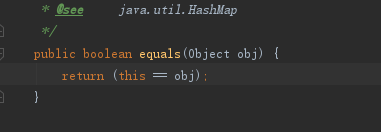

### java-8语言特性

（1）**Lambda 表达式** − Lambda 允许把函数作为一个方法的参数（函数作为参数传递到方法中）

（2）**方法引用** − 方法引用提供了非常有用的语法，可以直接引用已有Java类或对象（实例）的方法或构造器。与lambda联合使用，方法引用可以使语言的构造更紧凑简洁，减少冗余代码。可以理解为：更简洁的方法调用。

（3）**默认方法** − 默认方法就是一个在接口里面有了一个实现的方法。

（4）**重复注解** − 重复注释提供了将同一注释类型多次应用于同一声明或类型使用的能力。比如  @service 可以多次应用在类上。

（5）**StreamAPI** − 对集合的流式操作，对元素进行批量操作。

有几个重要的概念：过滤器，映射器，迭代器，这些操作操作称为聚合操作函数

Predicate：谓语函数接口，用于判断条件，返回一个boolean值

Consumer：接口单个参数，没有返回值得函数接口


### java-Object类

**定义：**所有的java对象的根类，所有的对象，数组都实现了Object类的方法。

**方法解读**

（1）getClass：返回java运行时的Class对象

（2）hashCode：返回对象的哈希码值。支持这种方法是因为HashMap提供的哈希表的好处。

​     **一个对象在程序运行的过程中，多次调用hashCode方法返回的值总是相同的int值**。

​     如果两个对象使用equals方法对比相等，那这个两个对象必然是hashCode也相等。

 （3）equals：比较两个对象的应用是否相等（**equals方法在非空对象引用上实现了一个等价关系**），默认是比较引用，代码实现如下：



 （4）clone：复制并返回对象

 （5）notify：唤醒在此对象的【监视器】上【等待】的【单个线程】，如果有多个线程正在等待这个对象，那么其中一个线程将被唤醒（如果有多个线程争抢该对象上的锁，notify通知之后，只有其中的一个线程能获取对象的锁）线程通过调用一个等待（wait）方法来等待对象的监视器，被唤醒的线程仍然无法获取到锁，直到拥有对象锁的线程放弃了对象锁（**本质上就是发出个通知：你们准备开始抢锁吧，等我执行完就开始抢** ）。

​         notify方法只能由对象监视器的所有者线程调用，线程可以通过3种方式拥有对象的监视器：

​         **通过执行该对象的同步实例方法**

​         **通过执行同步语句的主体对对象进行同步。**

​         **对于Class类型的对象，通过执行该类的同步静态方法。**

​       可能会导致死锁？

 （6）notifyAll：**唤醒在该对象的监视器上等待的所有线程**，最终所有等待的线程都会被执行，只是不是同时执行，都是按获取锁的执行顺序执行。

   **区别：**notify只是随机唤醒其中的一个等待线程，唤醒后不存在竞争锁的情况，而notifyAll 唤醒了所有wait的线程，存在锁竞争的情况。

  （7）wait：调用方法会使得当前线程等待，直到另一个线程调用该对象的notify()方法或notifyAll()方法

​            调用该方法的当前线程必须首先获得对象的监视器。


​     等待总是应该在循环中发生，虚假唤醒操作，如果使用if做判断，线程被唤醒后，会直接做下面的语句，形成一种虚假唤醒。

被唤醒的线程需要和其他线程竞争锁资源(最终只有一个线程获取到），那么当被唤醒的线程获得锁资源的时候，之前的条件可能又不满足了。如果while改成if，那么被唤醒的线程继续执行（默认条件任然满足），这明显会导致并发问题，比如超额生产、消费。

参考：https://baijiahao.baidu.com/s?id=1683304206957172623&wfr=spider&for=pc

​           https://www.cnblogs.com/amberbar/p/13290672.html

```
 synchronized (obj) {
         while (<condition does not hold>)
             obj.wait(timeout);
         ... // Perform action appropriate to condition
     }
```

（5）finalize方法：当垃圾收集确定不再有对对象的引用时，**由垃圾收集器在对象上调用**。子类可以重写finalize方法以便在垃圾收集器调用的时候进行其他资源的释放，可以参照FileInputStream的finalize方法。

  **总结:**对象监视器，等待-通知-获取对象监视器-执行  模式来实现线程间通信

  每个锁对象都有两个队列，一个是就绪队列，一个是阻塞队列。就绪队列存储将要获取锁的线程，阻塞队列存储被阻塞的线程（例如线程被wait后就进入阻塞队列）。先进入阻塞队列，被唤醒后再进入就绪队列。

### java-Thread类

#### sleep方法

native方法，线程暂停执行，可以暂停指定的时间，如果该线程拥有监视器，并不放弃监视器，依然拥有监视器（也就是锁），暂停期间线程执行阻塞，方法会抛出InterruptedException异常，就是需要在休眠期间监听到线程中断的信号。

#### start方法

native方法，启动线程，线程不一定马上运行。同一个线程只能被执行一次，不可以重复开启线程，后面JVM会调用run方法。

#### interrupt方法

1、给线程发起中断指令的方法，**该方法执行后，线程不一定马上停止，只是加了一个停止的标记位。**

2、线程在执行任务的时候，如果有调用sleep方法，必须捕获InterruptedException异常，目的就是为了能让正在休眠的线程收到线程被中断的通知而去做中断处理：

```java
 @Override
    public void run() {

        System.out.println("线程"+Thread.currentThread().getName()+"开始执行");

        try {
            Thread.sleep(10*1000);

        } catch (InterruptedException e) {
            System.out.println("收到了线程中断的通知");
            System.out.println(Thread.currentThread() + " interrupted:" + Thread.interrupted());
            e.printStackTrace();
        }

        System.out.println("休眠后的逻辑");
        System.out.println("线程"+Thread.currentThread().getName()+"执行结束");
    }
```


#### interrupted方法

静态方法，测试**当前线程**是否已经被中断，调用该方法**将清除线程的中断状态**,该方法本质上是调用了isInterrupted方法，isInterrupted是个native方法，可以传入是否清除中断状态的入参，interrupted就是传入true所以会清除中断标识，该方法是检查当前线程。

#### isInterrupted方法

实例方法,测试**此线程**是否已被中断。线程的中断状态不受此方法的影响。由于线程在中断时不是活动的而忽略的线程中断将由这个返回false的方法反映出来，该方法的作用线程对象，如A线程调用B线程的isInterrupted方法，代表判断的是B线程的中断状态。

#### join方法

**等待线程执行结束（最多等待的时间可以设置），简而言之，等待子线程完成之后再执行后面的主线程逻辑**，实现原理：外部线程调用执行线程的join（synchroized修饰），如果线程没有执行完成，则调用wait使得线程等待（释放锁），直到该线程运行结束,线程运行结束的时候会调用this.notifyAll(),则可继续运行代码，源码如下：

所以java的作者不建议在Thread类的实例中手动的调用wait，notify，notifyAll等方法（个人感觉这个方法像是一个监听通知的方法，监听线程完成的时候，发出线程完成的同通知，执行后面的流程，**我等你执行完吧，等你执行完，我再往下执行**）

```java
public final synchronized void join(long millis) -- 使用了 synchronized 关键字修饰
    throws InterruptedException {
        long base = System.currentTimeMillis();
        long now = 0;

        if (millis < 0) {
            throw new IllegalArgumentException("timeout value is negative");
        }

        if (millis == 0) {// 没有设置等待时间时，一直默认等待，知道线程完成后
            while (isAlive()) {// 使用while的目的是为了防止“虚假唤醒”
                wait(0);// 调用该方法，会使得主线程停止，并且让出监视器，该线程执行结束的时候，会调用this.notifyAll，可使得任务继续运行。
            }
        } else {
            while (isAlive()) {// 如果线程还处于活动（未完成）状态
                long delay = millis - now;
                if (delay <= 0) {// 如果计算出的时间小于0，直接跳出循环
                    break;
                }
                wait(delay);//等待时间
                now = System.currentTimeMillis() - base; // 收到通知后已经运行的时间
            }
        }
    }
```

join执行逻辑


#### currentThread方法

静态方法：返回当前正在执行的线程对象的引用，如main线程。

#### isAlive方法

测试线程是否处于“活动或者说运行”状态（何为活动状态？如果一个线程已经启动并且还没有死亡，那么它就是活的。）**判断线程是否运行结束可以使用该方法。**

#### 线程状态

java.lang.Thread.State  6种线程状态

```java
 public enum State {
        /**
         * 尚未启动的线程的状态
         */
        NEW,

        /**
         * 可运行线程的线程状态。处于可运行状态的线程正在Java虚拟机中执行，但它可能正在等待来自操作系统	          * (如处理器)的其他资源（也就是可能也不是正在执行）。
         */
        RUNNABLE,

        /**
         *阻塞状态：比如等待调用被synchronized修饰的同步方法（等待monitor锁）或者调用Object.wait方          * 法后重新又进入方法的执行（先调用wait方法，其他线程又调用了notify，该线程又继续执行，但只有其          * 他线程执行完成的时候，该线程才能执行）
         */
        BLOCKED,

        /**
         * 等待状态，以下情况会导致线程处于等待状态：
         *
         * 调用Object.wait（未设置超时时间）
         * 调用Thread.join（未设置超时时间）join方法，本质上也是调用了wait方法。
         * 调用LockSupport.park
         
         * 处于等待状态的线程正在等待另一个线程执行特定的操作。
         * 例如，在一个对象上调用object.wait()的线程正在等待另一个线程在该对象上调用                        * object.notify()或object.notifyall()。调用thread.join()的线程正在等待指定的线程止。
         */
        WAITING,

        /**
         * 线程有时间的等待。
         * 因为调用了以下方法之一，并指定了正等待时间:
         * Thread.sleep
         * Object.wait with timeout
         * Thread.join with timeout
         * LockSupport.parkNanos
         * LockSupport.parkUntil
         * 
         */
        TIMED_WAITING,

        /**
         * 终止状态：线程执行完成
         */
        TERMINATED;
    }
```

```
BLOCKED和WAITING都是非活动线程的状态，但是WAITING线程如果不先进入BLOCKED状态就不能运行。等待线程“不想”活动，而阻塞线程“想”活动，但不能，因为不是轮到它们。
```

#### 守护线程-daemon

在java中，线程分为两种：用户线程和守护线程。用户线程拥有比价高的优先级。守护线程会随之JVM的关闭而自动结束

### java-Future类

Future（未来，将来的意思）表示**异步**计算的结果，作为java多线程并发包中重要的一个工具。提供了**检查计算结果**、**等待结果完成、**

**获取计算结果**等方法，只有计算结果完成，才能调用**get**方法获取到结果，**如果结果没有完成则会一直阻塞**，直到有结果完成。可以调用**cancel**方法取消任务的执行，如果任务已经完成，则不能取消任务。

示例用法：

```java
interface ArchiveSearcher { String search(String target); }
 class App {
   ExecutorService executor = ...
   ArchiveSearcher searcher = ...
   void showSearch(final String target)throws InterruptedException {
     // 使用Future来获取异步任务执行的结果  
     Future<String> future = executor.submit(new Callable<String>() {
         public String call() {
             return searcher.search(target);
         }});
     displayOtherThings(); // do other things while searching
     try {
       displayText(future.get()); // use future  使用get方法获取异步任务执行的结果
     } catch (ExecutionException ex) { cleanup(); return; }
   }
 }
```


该接口提供的能力：

- cancel方法：试图取消此任务的执行，如果任务已经完成，这个尝试将会失败，如果这个任务还没有开始，则会停止任务，可以传出参数来决定如果任务正在运行，是否中断任务的执行。

- isCancelled ：任务是否被取消，如果该任务在正常完成之前被取消，则返回true。

- isDone：如果任务完成，返回true。完成可能是由于正常终止、异常或取消——在所有这些情况下，该方法都将返回true。

- get：如果需要，则等待计算完成，然后检索其结果。（阻塞等待，直到有结果），会抛出3种异常

  CancellationException -如果计算被取消

  ExecutionException—如果计算抛出异常

  InterruptedException—当前线程在等待时被中断 

- get(long timeout,TimeUnit unit)：如果有必要，最多在给定时间内等待计算完成，然后检索其结果(如果可用)。

### java-FutureTask类

Future接口的基本实现类，具有启动计算、取消计算、查询结算结果等方法，只有结算有结果，才能获取到，否则get方法将会阻塞，计算完成，则不能重启或者取消任务。

FutureTask可以用来包装Callable或Runnable对象。因为FutureTask实现了Runnable，所以FutureTask可以提交给Executor执行。

该类的继承关系如下：


多线程编程中，一种是开启一个任务，**不需要知道它的执行结果，这种情况下使用Runable**，***一种情况是需要知道任务执行的结果，这个时候使用Callable来定义任务，使用Future来获取任务执行的结果***。

详细方法如下：


（1）构造方法

FutureTask(Callable<V> callable)  **可以传入Callable类型**

FutureTask(Runnable runnable, V result) **也可以传入Runnable类型，并且传入一个result结果**

### ThreadPoolExecutor类

**线程池执行器**

先看下继承关系，如下图：


Executor接口：


ExecutorService接口：


- void shutdown():
- List<Runnable> shutdownNow():尝试停止所有正在执行的任务，停止等待任务的处理，并返回等待执行的任务列表。
- submit:<T> Future<T> submit(Callable<T> task),提交一个有返回值的任务执行，并返回一个表示该任务没有结果的Future。Future的get方法将在任务成功完成时返回任务的结果。
- <T> Future<T> submit(Runnable task,T result)：如果参数是Runnable（Runnable本身不具备返回值的能力），需要传入一个结果对象，result。

ThreadPoolExecutor注意点：**默认的JDK实现中，即便是核心线程数，也只有在任务到达的时候创建（多少有点违背线程池的初衷：提前把资源创建好，任务到达的时候直接获取就是）**，但是可以提前调用**prestartAllCoreThreads()**方法来初始化线程任务，可以设置核心线程数的大小，最大线程数的大小，非核心线程数的存活时间（就好比一个公司里面一个团队，有核心成员，裁员的时候，只裁员非核心的）

（1）线程池里面两个重要的参数：workerCount（正在运行的线程数）runState（运行状态），线程池的作者正是把这两个参数合并到一个整型变量中，来完成对整个线程池状态的控制。

（2）线程池的生命周期状态：

```
RUNNING（运行中）：接受新任务并处理排队的任务
SHUTDOWN（关停）：不接受新任务，但处理排队的任务
STOP（停止）：不接受新任务，不处理排队的任务，并中断正在进行的任务
TIDYING（整理）：所有任务已结束，工作线程数为0，线程转换到状态整理，是否运行terminated()钩子方法
TERMINATED（终止）：terminated()钩子方法，已经被执行
```

状态之间的转换过程：

```
RUNNING -> SHUTDOWN：调用了shutdown()方法之后
(RUNNING or SHUTDOWN) -> STOP：调用了shutdownNow()方法之后
SHUTDOWN -> TIDYING：当队列（任务队列）和池（运行核心线程数）都为空时
STOP -> TIDYING：当池为空时
TIDYING -> TERMINATED：当terminated()钩子方法完成时
```

线程池各种状态代码：

```java
    private final AtomicInteger ctl = new AtomicInteger(ctlOf(RUNNING, 0));
    private static final int COUNT_BITS = Integer.SIZE - 3; //32位减去3位，29位
    private static final int CAPACITY   = (1 << COUNT_BITS) - 1; //容量

    // runState is stored in the high-order bits（runState存储在高阶位中）
    private static final int RUNNING    = -1 << COUNT_BITS;（java 位运算，向左移动29位，地位0补齐）
    private static final int SHUTDOWN   =  0 << COUNT_BITS;
    private static final int STOP       =  1 << COUNT_BITS;
    private static final int TIDYING    =  2 << COUNT_BITS;
    private static final int TERMINATED =  3 << COUNT_BITS;

    // Packing and unpacking ctl（装箱和拆箱ctl）
    // 使用workerCount 和 runState 组合成 ctl，或者从 ctl中获取到workerCount和runState
    private static int runStateOf(int c)     { return c & ~CAPACITY; }
    private static int workerCountOf(int c)  { return c & CAPACITY; }
    private static int ctlOf(int rs, int wc) { return rs | wc; }
```

###  LockSupport类

基本线程阻塞原语（可以是线程停止运行），这个类与使用它的每个线程关联一个许可，如果许可证可用，对park的调用将立即返回，并在此过程中消耗许可证;否则可能堵塞。如果许可证尚未可用，则调用unpark使其可用。(但与信号量不同的是，许可证不会累积。最多只有一个。)

方法park和unpark提供了有效的**阻塞**和**解除阻塞**线程的方法。在一个线程调用park和另一个线程试图unpark之间的竞争将保持活性。park方法也可以在任何其他时间“没有原因”地返回，因此通常必须在返回时重新检查条件的循环中调用。从这个意义上说，park是对“忙碌等待”的优化，它不会浪费太多时间旋转，但必须与unpark配对才能有效（减少使用自旋而引起的开销？）。

```java
while (!canProceed()) 
{
    ... LockSupport.park(this);
}
```

简单的使用示例：

```java
// 先进先出互斥
class FIFOMutex {
   // 定义一个原子类型的boolean
   private final AtomicBoolean locked = new AtomicBoolean(false);
   // 非阻塞的线程安全的队列
   private final Queue<Thread> waiters = new ConcurrentLinkedQueue<Thread>();

   public void lock() {
       boolean wasInterrupted = false;
       Thread current = Thread.currentThread();
       // 线程加入到等待队列中
       waiters.add(current);

       // Block while not first in queue or cannot acquire lock
       // Queue.peek 获取队列的第一个元素
       while (waiters.peek() != current || !locked.compareAndSet(false, true)) {
           LockSupport.park(this);
            // ignore interrupts while waiting
           if (Thread.interrupted())
               wasInterrupted = true;
       }
       
       // 删除第一个元素
       waiters.remove();
       // reassert interrupt status on exit
       if (wasInterrupted)          
           current.interrupt();
   }

   public void unlock() {
       locked.set(false);
       LockSupport.unpark(waiters.peek());
   }
 }
```

### Java-内部类

回调：回调就是把一个**函数作为参数**传到另一个函数里面，当那个函数执行完之后，再执行传进去的这个函数。

使用大白话描述：A给B发出指令，同时告诉B，如果指令执行结束后，可以执行C操作，其中C就是回调函数。

JavaScript实现

```javascript
// 被调用的函数
function print(a,fun){
	console.log(a);
	fund();
}
// 回调函数
function callback(){
	console.log("调用回调函数callback");
}
// 主函数
function main(){
	//调用函数，并且传入回调函数
	print("参数a",callback);
}


```

C语言实现

```
#include<stdio.h>

// 被调用函数，函数指针参数 无返回值，参数为int的函数
void fun(int a,void (*c)(int))
{
	printf("\nfun接受参数：%d\n",a);
	a = a * 1 - 5 + 6 / 7 * 8;
	(*c)(a);
}
// 回调函数1
void callback1(int a)
{
	printf("回调1结果：%d\n",a);
}
// 回调函数2
void callback2(int a)
{
	printf("回调2结果：%d\n",a*2);
}
int main()
{
	fun(2,callback1);
	fun(2,callback2);
}
```

java中的回调函数如何实现呢？java中的回调是用异步接口实现，使用方法与上述类似，只是传入的参数为接口。

```java
/**
回调接口
**/
public interface CallBack(){
	void back(int result);
}
/**
被调用方
**/
public class Callee{
    public void fun(int a,CallBack callBack){
         System.out.println(i);
         callBack.back(i);
    }
}
/**
主线程调用
**/
public static void main(String[] args){
    Callee callee = new Callee();
    callee.fun(2,new CallBack{
        @Override
        public void call(int result){
             System.out.println("回调函数收到结果:"+result);
        }
    });
}
```

java异步调用回调模式

（1）定义回调函数（2）定义调用的方法（3）发起函数调用时使用多线程的方式，并且传入回调函数。

### java-Unsafe类

java中提供的一个低级别（如直接操作内存）的操作类集合，不安全的操作，虽然这个类中的方法都是公开的，但是只有可信任的代码（何为可信任的代码？）才能获取该类的实例。它是java中原子类中CAS操作的基础，如juc包中的AtomicInteger以及其他的原子类,使用该类应该小心，**因为它可以在内存中读取和写入任何数据**。


该类中大部分的方法是native方法，意味着在JVM中使用的是本地方法栈，实际上通过获取变量的绝对地址来操作变量。

使用该类实例的前提必须是系统类加载器加载的class（也就是java类库定义的），否则会抛出异常。

```java
 @CallerSensitive
    public static Unsafe getUnsafe() {
        Class<?> caller = Reflection.getCallerClass();
        if (!VM.isSystemDomainLoader(caller.getClassLoader()))
            throw new SecurityException("Unsafe");
        return theUnsafe;
    }
```

普通的用户如果要使用只能是通过反射的方法获取，如下

```java
// 通过反射的方式直接获取Unsafe类中的theUnsafe属性
Field field = Unsafe.class.getDeclaredField("theUnsafe");
field.setAccessible(true);
Unsafe unsafe = (Unsafe) field.get(null);
System.out.println(unsafe);
```


```
说一下offset，offeset为字段的偏移量，每个对象有个地址，offset是字段相对于对象地址的偏移量，对象地址记为baseAddress，字段偏移量记为offeset，那么字段对应的实际地址就是baseAddress+offeset，所以cas通过对象、偏移量就可以去操作字段对应的值了。
```

```java
/**
从java对象的偏移位置处获取一个int值（从偏移位置获取一个32位值？）
**/
public native int getInt(Object o, long offset);

/**
方法描述：将值存储到给定的Java变量中。
Object o:在堆中的java对象
long offset:变量在java堆中的位置
int x:要存储到指定Java变量中的值
**/
public native void putInt(Object o, long offset, int x);

/**
方法描述：从给定的Java变量中获取一个引用值（是java对象）。
Object o:在堆中的java对象
long offset:变量在java堆中的位置
**/
public native Object getObject(Object o, long offset);

/**
方法描述：从给定的内存地址中获取一个值。
Object o:在堆中的java对象
long offset:变量在java堆中的位置
**/
public native byte getByte(long address);

/**
方法描述：将值存储到给定的内存地址中
Object o:在堆中的java对象
long offset:变量在java堆中的位置
**/
public native void  putByte(long address, byte x);

/**
方法描述：从给定的内存地址获取本机指针
**/
public native long getAddress(long address);

/**
将本机指针存储到给定的内存地址中。
**/
public native void putAddress(long address, long x);

/**
分配一个新的本机内存块，以字节为单位
**/
public native long allocateMemory(long bytes);

/**
调整一个新的本机内存块的大小，到给定的字节大小。
**/
public native long reallocateMemory(long address, long bytes);

public native long staticFieldOffset(Field f);

/**
方法描述：原子更新对象中的变量值，底层实现为CPU指令cmpxchg,具有原子性。
Object o:在堆中的java对象
long offset:变量在java堆中的位置
Object expected：预期值
Object x：更新的最终值
**/
public final native boolean compareAndSwapObject(Object o, long offset,
                                                     Object expected,
                                                     Object x);
/**
使用volatile的语义从给定的Java变量中获取一个引用值
**/
public native Object getObjectVolatile(Object o, long offset);

/**
解除阻塞在park的给定线程
**/
public native void unpark(Object thread);

/**
暂停当前执行的线程
**/
public native void park(boolean isAbsolute, long time);

/**
使用原子的方式增加long值
**/
public final long getAndAddLong(Object o, long offset, long delta)；
```

#### 关于内存分配

通过Unsafe操作的内存属于堆外内容，无法使用JVM的垃圾回收器回收。

总结：该类中通过直接使用内存地址的方式改变内存的内容，诸如compareAndSwap之类的方法，平且通过了暂定线程和解除暂停线程的方法park、unpark等方法。

### java-NIO

更高效的操作IO。

**Buffer：缓存区，底层由数组实现。**

java 中的直接内存和非直接内存

**Channel：I/O操作的连接。**

表示对一个IO设备的连接，比如硬件设备、网络、文件等。通道对于多线程访问是安全的。

既可以操作读数据，也可以操作写数据。

**Selector:选择器，SelectableChannel对象的多路复用器。Selector可以同时监控多个SelectableChannel的IO状况**

可以通过调用该类的open方法来创建选择器，该方法将使用系统的默认选择器提供程序来创建新的选择器。还可以通过调用自定义选择器提供程序的openSelector方法来创建选择器。选择器在通过close方法关闭之前保持打开状态。

可选择通道与选择器的注册由SelectionKey对象表示。选择器维护三组选择键:

- 【键集】包含表示此选择器的当前通道注册的键。该集合由keys方法返回。
- 【所选键集】在先前的选择操作期间，检测到每个键的通道已准备好进行在键的兴趣集中标识的至少一种操作。该集合由selectedKeys方法返回。所选键集始终是键集的子集。
- 【已取消键集】是已取消但其通道尚未取消注册的键集。这个集合不能直接访问。取消的键集始终是键集的子集。

作为通过通道的register方法注册通道的副作用，一个键被添加到选择器的键集中。在选择操作期间，取消的键将从键集中删除。键集本身不能直接修改。

当键被取消时，通过关闭其通道或调用其cancel方法，键被添加到其选择器的已取消键集中。取消一个键将导致其通道在下一个选择操作期间被注销，此时该键将从所有选择器的键集中删除。

通过选择操作将键添加到选定键集中。可以通过调用该集合的remove方法或调用从该集合获得的迭代器的remove方法，直接从选中的键集合中删除键。键永远不会以任何其他方式从选定键集中删除;特别是它们不会作为选择操作的副作用而被移除。键不能直接添加到选定键集。

**SelectionKey**:表示使用选择器注册SelectableChannel的令牌。

### linux网络编程


#### 字节序问题

字节序是由于不同的主处理器和操作系统，对**大于一个字节**的变量在内存中的存放顺序不同而产生的。

例如一个16位的整数，它由两个字节构成，在有的系统上会将高字节放在内存的低地址上，有的系统则将高字节放在内存的高地址上。

高字节->内存的低地址    

高字节->内存的高地址

例如变量0xabcd在大端字节序和小端字节序的系统中二者存放的顺序是不同的，如下：


**在网络通讯中，使用的是大端字节序**，所以对应小端字节序的系统，发送网络数据的时候，需要转换成大端字节序。（大端字节序的系统不需要转换，可直接发送）

### java-JNI

简而言之：java调用其他语言的函数。

出现背景：java本身无法满足程序的需求，需要使用其他方式实现。