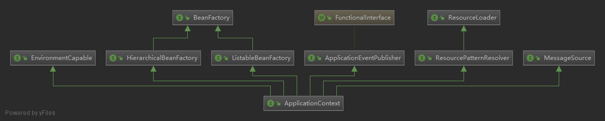
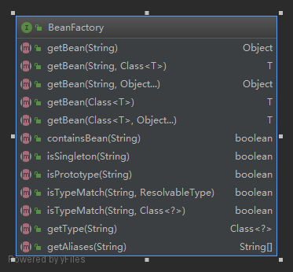
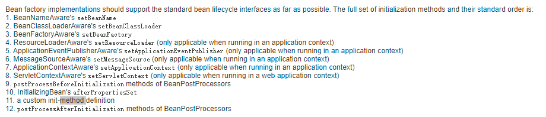
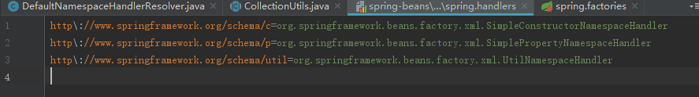
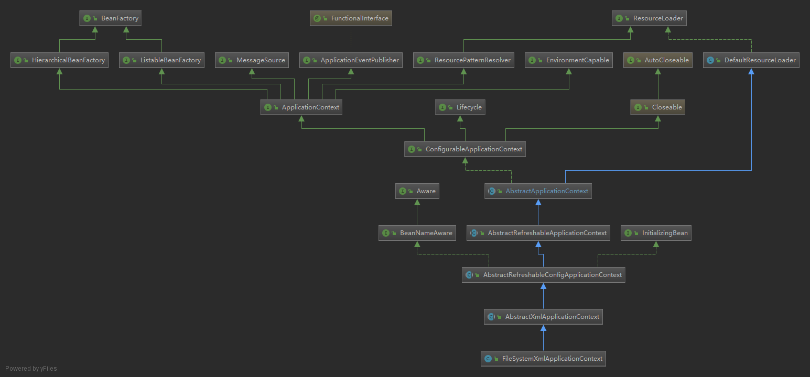
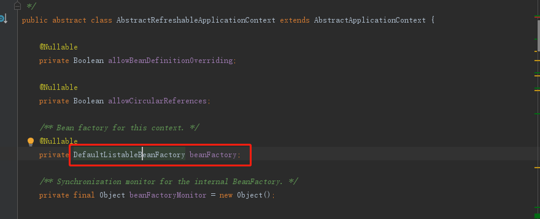

# spring-framework

## 控制反转（IoC）&依赖注入（DI）

IoC：使用框架容器来控制对象的生产

DI：使用框架容器来组织各个模块的依赖关系

以上体现了一种：通过引入中间件，解耦系统中各个模块依赖关系的思维。

## ApplicationContext接口

定义:**为应用程序提供配置的中央接口。在应用程序运行时，这是只读的，但如果实现支持，可能会重新加载**

由上图可以知道ApplicationContext【应用程序上下文】接口继承了好多基础接口，官网给出ApplicationContext接口提供的能力如下：

- 用于访问应用程序组件的Bean工厂方法。从**ListableBeanFactory**继承【组件访问功能】
- 以通用方式加载文件资源的能力。继承自**ResourceLoader**接口【组件加载功能】。
- 将事件发布到已注册侦听器的能力。继承自**ApplicationEventPublisher**接口【事件发布功能】。
- 解析消息的能力，支持国际化。继承自**MessageSource**接口【消息解析功能】。
- 上下文继承能力，如一个单独的父上下文可以被整个web应用程序使用，而每个servlet都有自己独立于任何其他servlet的子上下文【上下文继承功能】

## BeanFactory接口

定义：**用于访问Spring bean容器的根接口。这是bean容器的基本客户端视图;其他接口如ListableBeanFactory和ConfigurableBeanFactory可用于特定目的**

BeanFactory接口提供的能力如下：

- BeanFactory是java组件的容器，是一个产生和提供组件的“工厂”

- 并不建议直接通过BeanFactory获取java组件，而是使用spring提供的依赖注入，这体现了java的编程思想：依赖接口而不是实现，可以灵活替换,以及开闭原则。

- 通常，BeanFactory将加载存储在配置源(如XML文档)中的bean定义，并使用org.springframework.beans包来配置bean。然而，实现可以在必要时直接在Java代码中返回它创建的Java对象。对于如何存储定义没有限制:LDAP、RDBMS、XML、属性文件等。我们鼓励实现支持bean之间的引用(依赖注入)，这句话也说明了BeanFactory主要的工作内容。

  

Bean工厂实现应该尽可能地支持标准的Bean生命周期接口。完整的初始化方法及其标准顺序为:

参照spring官方api：https://docs.spring.io/spring-framework/docs/3.2.8.RELEASE/javadoc-api/

### ListableBeanFactory

BeanFactory接口的扩展：

## DefaultNamespaceHandlerResolver

NamespaceHandlerResolver接口的默认实现。根据映射文件中包含的映射将名称空间uri解析为实现类。默认情况下，该实现在**META-INF/spring**中查找映射文件。但是可以使用DefaultNamespaceHandlerResolver(ClassLoader, String)构造函数来更改文件路径。

文件中存储，XML中每个命名空间的处理类，如下：

# spring 中提供的两个最基本的接口 BeanFactory 和 ApplicationContent

他们之间的区别：BeanFactiory是实现IoC的基本形式，而 各种ApplicationContent是实现IoC的高级形式

2、启动spring的类和方法：

AbstractApplicationContext  ->  refresh()

**refresh方法是非常重要的一个方法，spring容器的启动入口**

2.1、启动步骤

AbstractRefreshableApplicationContext ->  refreshBeanFactory();

AbstractRefreshableApplicationContext -> loadBeanDefinitions(DefaultListableBeanFactory  beanFactory);//是个抽象方法，需要子类来实现

AbstractXmlApplicationContext  ->   loadBeanDefinitions(DefaultListableBeanFactory  beanFactory);//具体的实现（实现了父类的方法）

AbstractBeanDefinitionReader ->  loadBeanDefinitions(String... locations);//ApplicationContext中定义了BeanDefinitionReader，用于读取元数据（bean定义数据）

XmlBeanDefinitionReader ->  loadBeanDefinitions(EncodedResource encodedResource);

//读取xml中的内容

XmlBeanDefinitionReader ->  doLoadBeanDefinitions(InputSource inputSource, Resource resource)

{

}

//注册bean

XmlBeanDefinitionReader ->  doLoadBeanDefinitions(InputSource inputSource, Resource resource)

{

}

//注册bean

DefaultBeanDefinitionDocumentReader->  registerBeanDefinitions(Document doc, XmlReaderContext readerContext)

{

}

//注册bean

DefaultBeanDefinitionDocumentReader-> doRegisterBeanDefinitions(Element root){

}

//解析bean定义

DefaultBeanDefinitionDocumentReader-> parseBeanDefinitions(Element root, BeanDefinitionParserDelegate delegate){

}

//解析bean定义的过程

DefaultBeanDefinitionDocumentReader-> processBeanDefinition(Element ele, BeanDefinitionParserDelegate delegate){

}

//注册beanDefine

BeanDefinitionReaderUtils  ->  registerBeanDefinition(BeanDefinitionHolder definitionHolder, BeanDefinitionRegistry registry){

}

//将beanDefine放到beanDefinitionMap中

DefaultListableBeanFactory ->   registerBeanDefinition(String beanName, BeanDefinition beanDefinition){

}

//解析Bean最终要的方法

BeanDefinitionParserDelegate  -> parseBeanDefinitionElement  将xml中的bean定义转换成BeanDefinition

**2、IoC容器的依赖注入**

​    依赖注入的过程是用户第一次向IoC容器索要Bean时触发的，当然也可以通过BeanDefinition的lazy-init 属性来让容器完成对Bean的预实例化。

2.1 初始化所有的单例bean DefaultListableBeanFactory类中的 preInstantiateSingletons方法预初始化所有的单例bean

2.2 使用四种模式（工厂模式、构造方法）在容器中创建需要的bean AbstractAutowireCapableBeanFactory 类中的createBeanInstance方法

2.2.1 使用工厂方法模式创建bean实例

  使用无参的构造方法创建bean实例

  使用有参的构造的构造方法创建bean实例

3、spring容器在实例化bean之前会执行PostProcessorRegistrationDelegate中的invokeBeanFactoryPostProcessors方法回调容器中注册的BeanFactoryPostProcessor

PropertyResourceConfigurer 类中的postProcessBeanFactory 方法负责读取properties文件中的内容填充到bean的property中

PlaceholderConfigurerSupport 中的 doProcessProperties 方法

BeanDefinitionVisitor 类中的visitBeanDefinition方法

PropertyPlaceholderConfigurer 类中的resolvePlaceholder方法

4、<context:annotation-config /> spring容器开启自动注解

解释该注解的类：AnnotationConfigBeanDefinitionParser

## ApplicationContext

先看一张普通文件Spring运行上下文的继承图：

## DefaultListableBeanFactory

spring容器产生bean的最终载体

ApplicationContext中包含了BeanFactory实例，如下：

# spring-AOP

软件程序设计中模块化的思想。

传统的模块化：封装模块，需要的地方显示的调用。

非模块化调用：（1）Proxy代理对象（2）拦截器（3）字节码翻译技术