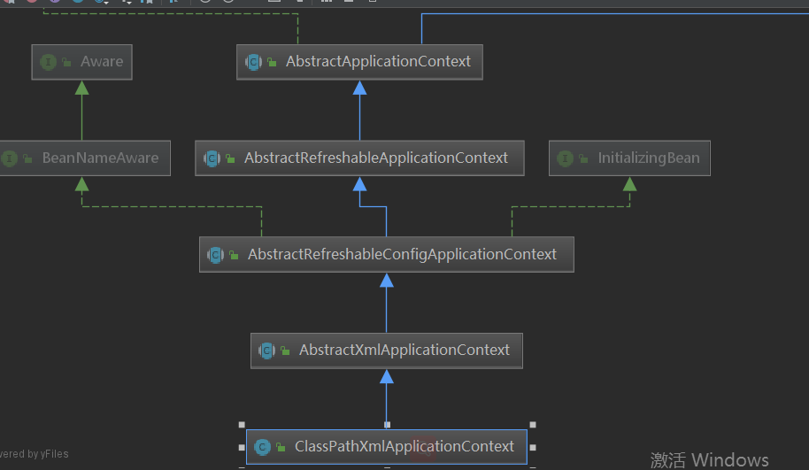
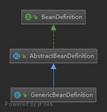
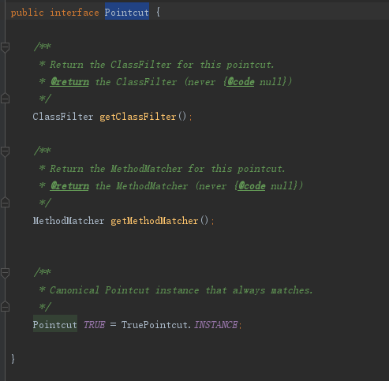

# spring-framework

## 控制反转（IoC）&依赖注入（DI）

IoC：使用框架容器来控制对象的生产

DI：使用框架容器来组织各个模块的依赖关系

**以上体现了一种编程：通过引入中间件，解耦系统中各个模块依赖关系，使得各个模块松耦合。**

spring 中提供的两个最基本的接口 BeanFactory 和 ApplicationContent。他们之间的区别：BeanFactiory是实现IoC的基本形式，而 各种ApplicationContent是实现IoC的高级形式。

## ApplicationContext

ApplicationContext中包含了BeanFactory，详情看代码

```java
public abstract class AbstractRefreshableApplicationContext extends AbstractApplicationContext {

	@Nullable
	private Boolean allowBeanDefinitionOverriding;

	@Nullable
	private Boolean allowCircularReferences;

	/** Bean factory for this context. */
	@Nullable
	private DefaultListableBeanFactory beanFactory;

	/** Synchronization monitor for the internal BeanFactory. */
	private final Object beanFactoryMonitor = new Object();
}
```




定义:**为应用程序提供配置的中央接口。在应用程序运行时，这是只读的，但如果实现支持，可能会重新加载**

由上图可以知道ApplicationContext【应用程序上下文】接口继承了好多基础接口，官网给出ApplicationContext接口提供的能力如下：

- 用于访问应用程序组件的Bean工厂方法。从**ListableBeanFactory**继承【组件访问功能】
- 以通用方式加载文件资源的能力。继承自**ResourceLoader**接口【组件加载功能】。
- 将事件发布到已注册监听器的能力。继承自**ApplicationEventPublisher**接口【事件发布功能】。
- 解析消息的能力，支持国际化。继承自**MessageSource**接口【消息解析功能】。
- 上下文继承能力，如一个单独的父上下文可以被整个web应用程序使用，而每个servlet都有自己独立于任何其他servlet的子上下文【上下文继承功能】

## BeanFactory

定义：**用于访问Spring bean容器的根接口。这是bean容器的基本客户端视图;其他接口如ListableBeanFactory和ConfigurableBeanFactory可用于特定目的**

BeanFactory接口提供的能力如下：

```java
public interface BeanFactory {
	String FACTORY_BEAN_PREFIX = "&";

	Object getBean(String name) throws BeansException;
	<T> T getBean(String name, @Nullable Class<T> requiredType) throws BeansException;
	Object getBean(String name, Object... args) throws BeansException;
	<T> T getBean(Class<T> requiredType) throws BeansException;
	<T> T getBean(Class<T> requiredType, Object... args) throws BeansException;
	boolean containsBean(String name);
	boolean isSingleton(String name) throws NoSuchBeanDefinitionException;
	boolean isPrototype(String name) throws NoSuchBeanDefinitionException;
	boolean isTypeMatch(String name, ResolvableType typeToMatch) throws NoSuchBeanDefinitionException;
	boolean isTypeMatch(String name, @Nullable Class<?> typeToMatch) throws NoSuchBeanDefinitionException;
	Class<?> getType(String name) throws NoSuchBeanDefinitionException;
	String[] getAliases(String name);
}
```


- BeanFactory是java组件的容器，是一个产生和提供组件的“工厂”

- 并不建议直接通过BeanFactory获取java组件，而是使用spring提供的依赖注入，这体现了java的编程思想：依赖接口而不是实现，可以灵活替换,以及开闭原则。

- 通常，BeanFactory将加载存储在配置源(如XML文档)中的bean定义，并使用org.springframework.beans包来配置bean。然而，实现可以在必要时直接在Java代码中返回它创建的Java对象。对于如何存储定义没有限制:LDAP、RDBMS、XML、属性文件等。我们鼓励实现支持bean之间的引用(依赖注入)，这句话也说明了BeanFactory主要的工作内容。

  

### ListableBeanFactory

BeanFactory接口的扩展接口，由接口定义的方法可以看出主要操作bean（BeanDefinition）定义的相关信息。

```java
public interface ListableBeanFactory extends BeanFactory {

	boolean containsBeanDefinition(String beanName);
	int getBeanDefinitionCount();
	String[] getBeanDefinitionNames();
	String[] getBeanNamesForType(ResolvableType type);
	String[] getBeanNamesForType(@Nullable Class<?> type);
	String[] getBeanNamesForType(@Nullable Class<?> type, boolean includeNonSingletons, boolean allowEagerInit);
	<T> Map<String, T> getBeansOfType(@Nullable Class<T> type) throws BeansException;
	<T> Map<String, T> getBeansOfType(@Nullable Class<T> type, boolean includeNonSingletons, boolean allowEagerInit)
			throws BeansException;
	String[] getBeanNamesForAnnotation(Class<? extends Annotation> annotationType);
	Map<String, Object> getBeansWithAnnotation(Class<? extends Annotation> annotationType) throws BeansException;
    
	<A extends Annotation> A findAnnotationOnBean(String beanName, Class<A> annotationType) throws NoSuchBeanDefinitionException;

}
```


### HierarchicalBeanFactory

BeanFactory接口的扩展接口，由接口定义的方法可以看出主要操作有层次结构的BeanFactory 关系

```java
public interface HierarchicalBeanFactory extends BeanFactory {
	BeanFactory getParentBeanFactory();
    /**
    返回本地bean工厂是否包含给定名称的bean，忽略在祖先上下文中定义的bean。
    **/
	boolean containsLocalBean(String name);
}
```

#### ConfigurableBeanFactory


### AutowireCapableBeanFactory

BeanFactory接口的扩展，提供自动装配的能力（里面包含了创建bean，自动装配bean的方法），前提是它们希望为现有的bean实例公开此功能。BeanFactory的这个子接口并不打算在普通应用程序代码中使用:对于典型用例，坚持使用BeanFactory或ListableBeanFactory。

```java
public interface AutowireCapableBeanFactory extends BeanFactory {
    
	int AUTOWIRE_NO = 0;
	int AUTOWIRE_BY_NAME = 1;
	int AUTOWIRE_BY_TYPE = 2;
	int AUTOWIRE_CONSTRUCTOR = 3;

    /**
    完全创建给定类的新bean实例执行bean的完整初始化，包括所有适用的beanpostprocessor。
    包含了初始化回调操作
    **/
    <T> T createBean(Class<T> beanClass) throws BeansException;

   /**
   自动注入bean的属性，existingBean代表已经存在的bean，实现方法中会根据依赖bean的名称从工厂中获取
   bean
   **/
	void autowireBean(Object existingBean) throws BeansException;

    /**
    里面会执行用户定义bean的init方法（自定义）
    **/
	Object configureBean(Object existingBean, String beanName) throws BeansException;

	/**
	更细化的createBean方法
	**/
    Object createBean(Class<?> beanClass, int autowireMode, boolean dependencyCheck) throws BeansException;
    
    /**
    更细化的autowire方法
    **/
	Object autowire(Class<?> beanClass, int autowireMode, boolean dependencyCheck) throws BeansException;
   
    /**
    根据名称或类型自动装配给定bean实例的bean属性，以便应用实例化后回调(例如注  释驱动的注入)。
    **/
	void autowireBeanProperties(Object existingBean, int autowireMode, boolean dependencyCheck) throws BeansException;

    /**
    同autowireBeanProperties方法
    **/
	void applyBeanPropertyValues(Object existingBean, String beanName) throws BeansException;

    /**
    初始化给定的原始bean
    **/
	Object initializeBean(Object existingBean, String beanName) throws BeansException;

    /**
    ** BeanPostProcessor before
    **/
	Object applyBeanPostProcessorsBeforeInitialization(Object existingBean, String beanName) throws BeansException;

    /**
    ** BeanPostProcessor after
    **/
	Object applyBeanPostProcessorsAfterInitialization(Object existingBean, String beanName) throws BeansException;

    /**
    销毁给定的bean实例
    **/
	void destroyBean(Object existingBean);

	<T> NamedBeanHolder<T> resolveNamedBean(Class<T> requiredType) throws BeansException;

	@Nullable
	Object resolveDependency(DependencyDescriptor descriptor, @Nullable String requestingBeanName) throws BeansException;

	@Nullable
	Object resolveDependency(DependencyDescriptor descriptor, @Nullable String requestingBeanName, @Nullable Set<String> autowiredBeanNames, @Nullable TypeConverter typeConverter) throws BeansException;

}
```

#### AbstractAutowireCapableBeanFactory

AutowireCapableBeanFactory的基础实现，主要实现了bean的创建，注入等功能。

2、启动spring的类和方法：

AbstractApplicationContext  ->  refresh()

**refresh方法是非常重要的一个方法，spring容器的启动入口**

2.1、启动步骤

AbstractRefreshableApplicationContext ->  refreshBeanFactory();

AbstractRefreshableApplicationContext -> loadBeanDefinitions(DefaultListableBeanFactory  beanFactory);//是个抽象方法，需要子类来实现

AbstractXmlApplicationContext  ->   loadBeanDefinitions(DefaultListableBeanFactory  beanFactory);//具体的实现（实现了父类的方法）

AbstractBeanDefinitionReader ->  loadBeanDefinitions(String... locations);//ApplicationContext中定义了BeanDefinitionReader，用于读取元数据（bean定义数据）

XmlBeanDefinitionReader ->  loadBeanDefinitions(EncodedResource encodedResource);

//读取xml中的内容

XmlBeanDefinitionReader ->  doLoadBeanDefinitions(InputSource inputSource, Resource resource);

//注册bean

XmlBeanDefinitionReader ->  doLoadBeanDefinitions(InputSource inputSource, Resource resource);

//注册bean

DefaultBeanDefinitionDocumentReader->  registerBeanDefinitions(Document doc, XmlReaderContext readerContext);

//注册bean

DefaultBeanDefinitionDocumentReader-> doRegisterBeanDefinitions(Element root);

//解析bean定义

DefaultBeanDefinitionDocumentReader-> parseBeanDefinitions(Element root, BeanDefinitionParserDelegate delegate);

//解析bean定义的过程

DefaultBeanDefinitionDocumentReader-> processBeanDefinition(Element ele, BeanDefinitionParserDelegate delegate);

//注册beanDefine

BeanDefinitionReaderUtils  ->  registerBeanDefinition(BeanDefinitionHolder definitionHolder, BeanDefinitionRegistry registry);

//将beanDefine放到beanDefinitionMap中

DefaultListableBeanFactory ->   registerBeanDefinition(String beanName, BeanDefinition beanDefinition);

//解析Bean最终要的方法

BeanDefinitionParserDelegate  -> parseBeanDefinitionElement()  将xml中的bean定义转换成BeanDefinition

**2、IoC容器的依赖注入**

​    依赖注入的过程是用户第一次向IoC容器索要Bean时触发的，当然也可以通过BeanDefinition的lazy-init 属性来让容器完成对Bean的预实例化。

2.1 初始化所有的单例bean DefaultListableBeanFactory类中的 preInstantiateSingletons方法预初始化所有的单例bean

2.2 使用四种模式（工厂模式、构造方法）在容器中创建需要的bean AbstractAutowireCapableBeanFactory 类中的createBeanInstance方法

2.2.1 使用工厂方法模式创建bean实例

  使用无参的构造方法创建bean实例

  使用有参的构造的构造方法创建bean实例

3、spring容器在实例化bean之前会执行PostProcessorRegistrationDelegate中的invokeBeanFactoryPostProcessors方法回调容器中注册的BeanFactoryPostProcessor

PropertyResourceConfigurer 类中的postProcessBeanFactory 方法负责读取properties文件中的内容填充到bean的property中

PlaceholderConfigurerSupport 中的 doProcessProperties 方法

BeanDefinitionVisitor 类中的visitBeanDefinition方法

PropertyPlaceholderConfigurer 类中的resolvePlaceholder方法

4、<context:annotation-config /> spring容器开启自动注解

解释该注解的类：AnnotationConfigBeanDefinitionParser

## ApplicationContext

先看一张普通文件Spring运行上下文的继承图：


## DefaultListableBeanFactory

spring容器产生bean的最终载体

ApplicationContext中包含了BeanFactory实例，如下：


### AbstractAutowireCapableBeanFactory


## BeanDefinitionRegistry

为保存bean定义的注册中心提供接口，例如RootBeanDefinition和ChildBeanDefinition实例，通常由内部使用AbstractBeanDefinition层次结构的beanfactory实现。

这是Spring bean工厂包中封装bean定义注册的唯一接口。标准的BeanFactory接口只包括对完全配置的工厂实例的访问。

Spring bean定义的读者希望处理这个接口的实现。Spring核心中已知的实现者是**DefaultListableBeanFactory**和**GenericApplicationContext**。

## BeanDefinition



## bean解析流程

spring 解析bean定义的阶段，只是将XML文件中的定义元数据，原封不动的转成Java的BeanDefinition，并无做任何初始化的操作。

BeanDefinitionParserDelegate：用于解析XML bean定义的有状态委托类。供主解析器和任何扩展BeanDefinitionParsers或BeanDefinitionDecorators使用。

主要解析<bean>标签以及其他如自定义xml标签。

#### 解析bean标签

```java
调用：org.springframework.beans.factory.xml.BeanDefinitionParserDelegate#parseBeanDefinitionElement(org.w3c.dom.Element)
返回：
class BeanDefinitionHolder{

    // bean 定义数据
    private final BeanDefinition beanDefinition;
    
    // bean 名称
	private final String beanName;

	// bean 别名
	private final String[] aliases;  
}
```

#### 解析自定义标签

```xml
<context:property-placeholder location="classpath:gaoxugang/conf/test.proerties"></context:property-placeholder>
```

看自定义标签之前先看下解析类结构

```java
NamespaceHandlerResolver：[Resolver]用于定位命名空间的解析类，如
定位“http://www.springframework.org/schema/context”的处理器为ContextNamespaceHandler
DefaultNamespaceHandlerResolver：NamespaceHandlerResolver接口的默认实现，所有的命名空间处理器都在类路径的META-INF/spring.handlers文件中存储，内容如下：
http\://www.springframework.org/schema/context=org.springframework.context.config.ContextNamespaceHandler
http\://www.springframework.org/schema/jee=org.springframework.ejb.config.JeeNamespaceHandler
http\://www.springframework.org/schema/lang=org.springframework.scripting.config.LangNamespaceHandler
http\://www.springframework.org/schema/task=org.springframework.scheduling.config.TaskNamespaceHandler
http\://www.springframework.org/schema/cache=org.springframework.cache.config.CacheNamespaceHandler
DefaultNamespaceHandlerResolver
NamespaceHandlerResolver接口的默认实现。根据映射文件中包含的映射将名称空间uri解析为实现类。默认情况下，该实现在/META-INF/spring/中查找映射文件。但是可以使用DefaultNamespaceHandlerResolver(ClassLoader, String)构造函数来更改文件路径。

根据命名空间名称获取对应的解析类，方法：NamespaceHandlerResolver#resolve，最终返回NamespaceHand
```

```java
NamespaceHandler：命名空间处理器，有多个实现，默认实现为 NamespaceHandlerSupport
具体的实现：ContextNamespaceHandler
每一个NamespaceHandler中又有多个Parser，如ContextNamespaceHandler中有
PropertyPlaceholderBeanDefinitionParser——>"property-placeholder"
PropertyOverrideBeanDefinitionParser-->"property-override"
```

```java
BeanDefinitionParser:bean装换器
有很多实现，如PropertyPlaceholderBeanDefinitionParser、PropertyOverrideBeanDefinitionParser

PropertyPlaceholderBeanDefinitionParser解析调用
（1）AbstractBeanDefinitionParser#parse
（2）AbstractSingleBeanDefinitionParser#parseInternal
（3）PropertyPlaceholderBeanDefinitionParser#getBeanClass//获取bean的class属性
（4）PropertyPlaceholderBeanDefinitionParser#doParse// 真正解析property-placeholder的方法
（5）AbstractPropertyLoadingBeanDefinitionParser#doParse// 先调父类的解析方法，解析如location属性
(6)PropertyPlaceholderHelper#replacePlaceholders// 处理站位符，${}字符等

```

## spring容器的扩展点

### BeanFactoryPostProcessor

spring bean工厂的后置处理器，允许自定义修改应用程序上下文的bean定义（bean元数据定义），调整上下文底层bean工厂的bean属性值，spring容器可以在bean定义中自动检测BeanFactoryPostProcessor ，并提前创建它们。PropertyResourceConfigurer、PropertyOverrideConfigurer 都是具体的实现。

**在标准初始化之后修改应用程序上下文的内部bean工厂。所有bean定义都已加载，但还没有实例化任何bean。这就允许覆盖或添加属性，甚至可以向预先初始化bean添加属性。在实现类方法postProcessBeanFactory中不要直接调用BeanFactory.getBean方法，因为这会导致bean对象的初始化**

例如通过配置文件定义bean属性的值，通过xml中的占位符（${}）进行属性的注入。

spring 配置文件

```xml
<!--属性占位符-->
	<context:property-placeholder location="classpath:gaoxugang/conf/test.proerties"/>

	<bean class="gaoxugang.pojo.MyDataSource">
		<property name="driverClassName" value="${jdbc.driverClassName}"/>
		<property name="url" value="${jdbc.url}"/>
		<property name="username" value="${jdbc.username}"/>
		<property name="password" value="${jdbc.password}"/>
	</bean>
```

属性配置文件：classpath:gaoxugang/conf/test.properties

```java
jdbc.driverClassName=org.hsqldb.jdbcDriver
jdbc.url=jdbc:hsqldb:hsql://production:9002
jdbc.username=sa
jdbc.password=root
```

最终执行的类是PropertySourcesPlaceholderConfigurer，该类实现了BeanFactoryPostProcessor接口，会在bean定义解析完成之后，spring容器会回调postProcessBeanFactory方法，来完成属性值得替换，具体的实现请看org.springframework.context.support.PropertySourcesPlaceholderConfigurer#postProcessBeanFactory

### BeanPostProcessor

BeanPostProcessor对已经初始化的bean做操作，

接口定义的方法,都是在bean实例化完成和依赖注入完成之后回调的，一个是自定义或者初始化方法调用之前，一个是初始化方法调用之后。

```java
/**
实例化、依赖注入完毕，在调用显示的初始化之前完成一些定制的初始化任务
**/
default Object postProcessBeforeInitialization(Object bean, String beanName) throws BeansException {
		return bean;
}
/**
实例化、依赖注入、初始化完毕时执行
**/
default Object postProcessAfterInitialization(Object bean, String beanName) throws BeansException {
		return bean;
}
```

### FactoryBean

这又是一个spring容器的扩展点，实现FactoryBean接口来自定义bean的实例化逻辑。FactoryBean接口是可插入到Spring IoC容器的实例化逻辑中的一个点，如果你有自己复杂的bean初始化逻辑，可以继承FactoryBean来实现自己的实例化逻辑

```java
public interface FactoryBean<T> {

    /**
    返回此工厂创建的对象的实例。实例可能是共享的，这取决于该工厂返回的是单例还是原型。
    **/
	T getObject() throws Exception;
    
    /**
    返回getObject()方法返回的对象类型，如果事先不知道该类型，则返回null
    **/
	Class<?> getObjectType();
    
    /**
    返回创建的bean是否是单例对象
    **/
	default boolean isSingleton() {
		return true;
	}
}
```

如下为定义的FactoryBean

```java
public class PersonBeanFactory implements FactoryBean<Person> {

	private static Person person = new Person();

	@Override

	public Person getObject() throws Exception {
		return person;
	}

	@Override
	public Class<?> getObjectType() {
		return Person.class;
	}

	@Override
	public boolean isSingleton() {
		return true;
	}
}
```

spring配置文件

```xml
<bean id ="person" class="gaoxugang.extension.PersonBeanFactory"></bean>
```

测试类

```java
@Test
	public void testFactoryBean(){
		// 启动spring 容器
		ApplicationContext ctx = new ClassPathXmlApplicationContext("gaoxugang/factoryBean.xml");

		// 获取factoryBean创建的bean实例
		Person person = ctx.getBean("person", Person.class);
		System.out.println(person);

		// 获取factoryBean实例本省
		PersonBeanFactory bean = ctx.getBean("&person", PersonBeanFactory.class);
		System.out.println(bean);
		System.out.println(bean.getObjectType());
	}
```


# spring-AOP

软件程序设计中模块化的思想。

传统的模块化：封装模块，需要的地方显示的调用。

非模块化调用：（1）Proxy代理对象（2）拦截器（3）字节码翻译技术

### spring-AOP相关的接口

#### Advice通知

Advice接口：Spring定义的AOP通知类接口

BeforeAdvice接口：AOP调用前通知接口

AfterAdvice接口：AOP调用后通知接口

ThrowsAdvice接口：目标方法调用异常时通知接口

#### Pointcut切点

**Pointcut切点**：决定Advice通知应作用于哪个点，通过Pointcut切点来定义需要增强的方法的集合（Advice通知作用，那么Pointcut则决定了这些通知作用作用域那些方法，圈定范围），常见的方式有：明确指定方法名称，使用正则表达式等等。



由上图可知，Pointcut接口放回MethodMatcher对象，使用MethodMatcher对象来判断方法是否是切点，是否需要做通知

JdkRegexpMethodPointcut:java正则表达式切点实现类，根据正则表达式匹配需要走通知的方法。

NameMatchMethodPointcut:使用方法名来匹配的切点实现类。

```java
protected boolean matches(String pattern, int patternIndex) {
		Matcher matcher = this.compiledPatterns[patternIndex].matcher(pattern);
		return matcher.matches();
	}
```

#### Advisor通知器

advisor把advice和pointcut结合起来。